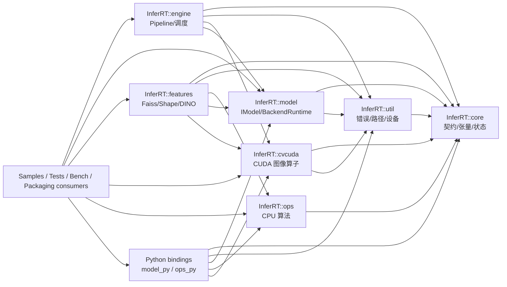
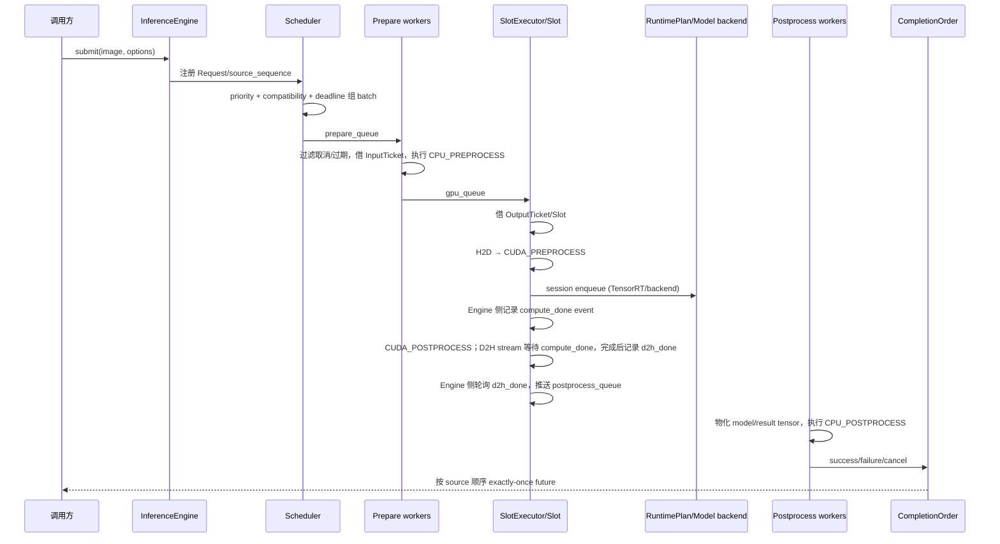

# InferRT 全仓结构分析

> 本文是面向维护者的导航和审查索引，不替代源码、CMake、DINO 规范或任务账本。它描述模块关系、数据流、消费者和证据边界；字段、算法常数、错误语义和验收阈值应回到链接目标核对。

## 1. 范围、时间点与证据规则

### 1.1 范围

覆盖当前仓库的顶层构建入口、`src` 各层、样例、测试、benchmark、Python 绑定、工具、安装/运行时部署，以及 DINO 区域检索的实现与设计合同。已有导航文档为：[`项目总览.md`](项目总览.md)、[`项目架构图谱.md`](项目架构图谱.md)、[`系统架构图`](InferRT系统架构图.html)、[`公共接口与消费者.md`](公共接口与消费者.md)、[`Engine 实现索引`](../src/engine/design.md)、[`DINO 区域检索流程`](../src/features/DinoRegionSearchFlow.md)。

本文时间点以 `WORKLOG.md` 中最新的 **2026-09-13** DINO 条目为准。仓库工作树含用户已有未提交改动及 DINO 新文件；本文不据此推断 Git 状态，也不把历史清单当作当前文件清单。

### 1.2 证据等级

| 标记 | 含义 | 使用规则 |
| --- | --- | --- |
| **当前源码/CMake直接结构** | 勘察报告对当前源码、公共头、CMake、测试/样例/工具的直接观察 | 用于说明入口、依赖、条件编译、调用方向和职责；精确行为回源码 |
| **现有索引/合同** | 既有架构索引、接口索引、DINO 设计/spec/schema/tickets | 用于导航、目标和审查规则；不能单独证明实现或通过 |
| **WORKLOG实测** | `WORKLOG.md` 指定日期条目记录的命令、资源规模与结果 | 只按日期、规模和测试范围引用；旧结果若被后续条目取代，不再作为当前结论 |
| **WORKLOG决策** | `WORKLOG.md` 记录的冻结、取舍或状态判断 | 表示账本决策，不等同于一次独立实测；需同时回指支撑它的实测或合同 |
| **WORKLOG未验证** | 账本明确列出的尚未完成、缺少资源或不具备验收条件的项目 | 只能写成未验证/不得视为通过，不能由样例、探测或设计目标补足 |
| **静态推断风险** | 由结构、链接、命名或覆盖边界推导出的维护风险 | 必须标注 `[静态风险]` 或 `[待核实]`，不写成已发生故障 |
| **设计目标** | DINO `01_design.md`、`02_spec.md` 中的要求 | 标为 `[设计目标]`；NOT_RUN、样例、tickets 不能写成实现或验收结果 |
| **验收合同** | DINO `03_test_acceptance.md` 定义的 TC/Gate 门槛矩阵 | 标为 `[验收合同]`；其 NOT_RUN 是合同初始状态，不是当前实测结果 |
| **已确认索引缺陷** | 直接检查路径后确认不存在的文件、目录或失效引用 | 标为 `[已确认索引缺陷]`，不再写成待核实，也不作为实现证据 |

阅读顺序：先看本页的拓扑和 SSOT，再按路径回源码/CMake；需要 DINO 细节时读 [`DinoRegionSearchFlow.md`](../src/features/DinoRegionSearchFlow.md) 与公共配置 [`DinoRegionSearch.hpp`](../src/features/include/inferrt/features/DinoRegionSearch.hpp)，需要当前实测时读 `WORKLOG.md` 的具体日期标题。

## 2. 顶层目录与构建矩阵

### 2.1 仓库角色

- `src/`：库的实现和公共头，按 `core`、`util`、`ops`、`cvcuda`、`model`、`engine`、`features`、`python` 分层。
- `cmake/`：依赖发现、编译选项、构建树、安装导出、测试环境和包配置；顶层入口是 [`CMakeLists.txt`](../CMakeLists.txt)。
- `3rdparty/`：GoogleTest/GMock、benchmark、cxxopts、yaml-cpp、pybind11、DLPack、vtest、cpuinfo 等接入。
- `samples/`：版本、CUDA 算子、模型、features、Engine 的可执行消费者；输入通常来自 `assets/` 和外部模型/索引。
- `tests/`：C++ 单元/集成、Python pytest、安装包 consumer/relocation；`benchmark/`：CUDA、Engine、模型、shape matcher 和 Python 对照测量。
- `tools/`：依赖路径与运行库部署、测试报告/质量门禁、DINO 开发集工具。`docs/`：导航、合同和设计材料，不是源码状态账本。

### 2.2 条件编译与组件

根 CMake 的主要开关默认启用 CUDA、TensorRT、tests、samples、benchmark、Python；ONNX Runtime、OpenVINO、sanitizer 和 docs 构建开关默认关闭。硬约束是：CUDA 开启必须能找到 CUDA 编译器；TensorRT 依赖 CUDA；ONNX/OpenVINO 还受 TensorRT 总门控。准确选项和版本由 [`CMakeLists.txt`](../CMakeLists.txt)、[`cmake/ConfigCUDA.cmake`](../cmake/ConfigCUDA.cmake)、[`cmake/ConfigTensorRT.cmake`](../cmake/ConfigTensorRT.cmake) 及相关 `Config*.cmake` 决定。

| 构建形态 | 主要目标 | 关键外部依赖/边界 |
| --- | --- | --- |
| Core-only | `core`、`util`、`ops` 及其测试 | 必须同时关闭 `INFERRT_ENABLE_CUDA` 与 `INFERRT_BUILD_TENSORRT`；不需要 CUDA/OpenCV；`ops` 为 CPU host-pointer 路径 |
| CUDA | 在上面增加 `cvcuda` | CUDA Runtime、OpenCV；逐文件 CUDA/ISA 实现 |
| Full TensorRT | 增加 `model`、`engine`、`features`、相应 samples/tests/benchmarks | CUDA、TensorRT、OpenCV；features 还需 Faiss；Engine 私有使用 cvcuda/yaml-cpp |
| 可选图后端 | 在 model 中加入 ONNX Runtime 或 OpenVINO adapter | 受 `BUILD_ONNX`/`BUILD_OPENVINO` 和上层 CUDA+TensorRT 门控；是否可用看构建条件 |
| Python | `inferrt_model_py`、`inferrt_ops_py` 两个 MODULE | 实际 `src/python` target 还要求 CUDA+TensorRT；pybind11、DLPack、NumPy |
Core-only 的可执行配置应以 [`CMakePresets.json`](../CMakePresets.json) 的 `core-only` preset 为准：它同时关闭 CUDA、TensorRT、Python、samples、benchmark、ONNX 和 OpenVINO，仅保留 tests；不要只关闭 CUDA 而保留默认开启的 TensorRT。

target 依赖方向可概括为：

各 target 的真实链接边界以 `src/*/CMakeLists.txt` 和 [`cmake/AddPluginLibrary.cmake`](../cmake/AddPluginLibrary.cmake) 为准。`core` 无项目外链接；`util` 公开依赖 core、私有使用 yaml-cpp/cpuinfo，CUDA 时增加 CUDA/NVML；`ops` 仅公开依赖 core；cvcuda、model、engine、features 均是 CUDA 路径。features 的 Faiss 是 target 级依赖，但 DINO 的当前扫描实现是连续数组穷举，不等于使用 Faiss ANN。

## 3. `src` 分层与边界

### 3.1 core：所有上层共享的契约 seam

[`src/core/include/inferrt/core/Status.h`](../src/core/include/inferrt/core/Status.h)、[`Exception.hpp`](../src/core/include/inferrt/core/Exception.hpp)、[`Tensor.hpp`](../src/core/include/inferrt/core/Tensor.hpp)、[`PreprocessSpec.hpp`](../src/core/include/inferrt/core/PreprocessSpec.hpp) 和 [`ModelContract.hpp`](../src/core/include/inferrt/core/ModelContract.hpp) 构成最底层公共 interface：状态/TLS 错误、值语义异常、checked shape/descriptor/buffer、预处理几何，以及后端无关的 model/plan/session/execute contract。

`Shape`、`TensorDesc`、`BufferView` 是张量大小、布局、内存种类和容量的单一来源；算术窄化与乘法溢出检查集中在 core。`PreprocessSpec` 只负责规格校验和 `resolvePreprocessGeometry()`；具体像素处理在 cvcuda 或 model/engine 路径。`IExecutionDescriptor`、`IExecutableModel`、`IExecutionPlan`、`ITensorRuntimeSession` 把上层与 TensorRT/图后端解耦，具体执行器不应把 TensorRT 类型泄漏到公共头。

### 3.2 util：错误、路径、设备和小型基础设施

[`src/util`](../src/util) 提供 CUDA/第三方错误转换（`CheckError`）、字符串、文件、路径、YAML manifest、计时、CPU/GPU 设备查询。它依赖 core，而 `ops` 不反向依赖 util。路径和文件工具是模型、安装工具和 DINO 接入的基础；DINO 契约中的 UTF-8 路径另由其私有 `DinoPaths` 统一转换。

### 3.3 ops：无 CUDA 的 CPU 算法模块

[`src/ops`](../src/ops) 对外提供 DBSCAN/HDBSCAN、Bezier/B-spline、RoIAlign、NMS 等 host 数据算子；实现由公共入口和私有距离/邻域/树索引协作者组成。聚类私有深模块可从 [`ClusteringCommon.cpp`](../src/ops/priv/ClusteringCommon.cpp)、[`ClusteringDistance.cpp`](../src/ops/priv/ClusteringDistance.cpp)、[`ClusteringNeighborhood.cpp`](../src/ops/priv/ClusteringNeighborhood.cpp)、[`ClusteringTrees.cpp`](../src/ops/priv/ClusteringTrees.cpp) 开始阅读。该层没有 CUDA/NVML/device-buffer 依赖；公共 `MemoryKind::DEVICE` 或 stream 不会自动赋予 ops CUDA 执行能力。

### 3.4 cvcuda：CUDA 图像算子 adapter

[`src/cvcuda/include/inferrt/cvcuda/IOperator.hpp`](../src/cvcuda/include/inferrt/cvcuda/IOperator.hpp) 和 `Op*.hpp` 是 move-only C++ PImpl wrapper，C 入口返回 `IRTStatus`；`ProtectCall` 把异常转换到 core 状态。私有 `.cu` 实现承载 Resize、Normalize、LetterBox、CvtColor、Integral、AdaptiveThreshold、NMS、RoIAlign 等 kernel。NMS 的 workspace RAII 和跨 stream/device 生命周期位于 [`src/cvcuda/priv/OpNMSImpl.cu`](../src/cvcuda/priv/OpNMSImpl.cu)。公共 cvcuda interface 不暴露私有实现类型。

### 3.5 model：模型 facade、生命周期与 backend adapter

公共 facade 是 [`IModel.hpp`](../src/model/include/inferrt/model/IModel.hpp)、[`IModelConfig.hpp`](../src/model/include/inferrt/model/IModelConfig.hpp)、[`ModelFactory.hpp`](../src/model/include/inferrt/model/ModelFactory.hpp)；后端中立 seam 是 [`BackendRuntime.hpp`](../src/model/include/inferrt/model/BackendRuntime.hpp)。实现入口是 [`IModel.cpp`](../src/model/IModel.cpp) 与 [`priv/IModelImpl.cpp`](../src/model/priv/IModelImpl.cpp)，后端位于 [`TensorRTBackend.cpp`](../src/model/priv/TensorRTBackend.cpp)、[`ONNXRuntimeBackend.cpp`](../src/model/priv/ONNXRuntimeBackend.cpp)、[`OpenVINOBackend.cpp`](../src/model/priv/OpenVINOBackend.cpp)。

IModel facade 负责 invalid-handle 保护和 legacy convenience API；IModelImpl 负责配置校验、build/load/save/build-or-load、manifest、feature-only 和运行时原子替换。TensorRT 类型集中在 backend adapter；ORT/OpenVINO 使用 host I/O 和各自 session。配置或 reload 失败时，临时 backend 被丢弃，旧 runtime/config 保留，这一生命周期语义应回实现和 model 测试核对。模型族（分类、ViT/DINO、YOLO、RF-DETR、SAM、LingBot）由私有派生实现注册；SAM3 的 native image encoder 是已记录的未实现边界，不应把注册兼容等同于可运行实现。

### 3.6 engine：不可变 PipelinePlan 加异步执行编排

公共入口是 [`EngineConfig.hpp`](../src/engine/include/inferrt/engine/EngineConfig.hpp)、[`InferenceEngine.hpp`](../src/engine/include/inferrt/engine/InferenceEngine.hpp)、[`Pipeline.hpp`](../src/engine/include/inferrt/engine/Pipeline.hpp)、[`BuiltinOperators.hpp`](../src/engine/include/inferrt/engine/BuiltinOperators.hpp)。`PipelineBuilder::build()` 编译 C++ 声明的、stage-aware 的 DAG，冻结 registry/plan；EngineConfig 读取 YAML 配置，但不从 YAML 解析 Pipeline 节点。生产构造要求 `(EngineConfig, shared_ptr<const PipelinePlan>)`，legacy pipeline 仅由测试 hook 提供。

关键 private 深模块：

- [`InferenceEngine.cpp`](../src/engine/InferenceEngine.cpp)：启动事务、状态转换、提交、同步 infer、shutdown 和故障编排。
- [`EngineScheduler.*`](../src/engine/priv/EngineScheduler.hpp)：优先级、compatibility key、动态组批、deadline 和 ingress policy。
- [`EngineStageQueue.*`](../src/engine/priv/EngineStageQueue.hpp)：阶段交接；实际 deque 没有独立容量上限。
- [`EngineTicketPool.*`](../src/engine/priv/EngineTicketPool.hpp)：pinned input/output ticket 和阻塞/abort。
- [`EngineStageWorkers.*`](../src/engine/priv/EngineStageWorkers.hpp)：CPU prepare/postprocess worker、批次失败/完成和阶段指标。
- [`EngineSlot.*`](../src/engine/priv/EngineSlot.hpp)、[`EngineSlotExecutor.*`](../src/engine/priv/EngineSlotExecutor.hpp)：每 device 的 stream/event、arena、session、H2D/compute/D2H 和 completion polling。
- [`EngineRuntimePlan.*`](../src/engine/priv/EngineRuntimePlan.hpp)、[`TensorRTRuntimePlan.*`](../src/engine/priv/TensorRTRuntimePlan.hpp)：Engine 配置到 model `IBackendRuntime` 的 adapter，不重新实现 TensorRT engine 读取或 binding。
- [`EngineCompletionOrder.*`](../src/engine/priv/EngineCompletionOrder.hpp)：按 source sequence 交付 future，并以 exactly-once 保护 success/failure/cancel。
- [`EngineMetricsFault.*`](../src/engine/priv/EngineMetricsFault.hpp)：批次终态、阶段延迟、fault history。

### 3.7 features：检索、聚类、预测、模板与 DINO 能力线

`src/features` 同时承载以下相互独立的公共能力线，不能只按 Faiss、shape、DINO 等少数线索理解：

- **Faiss 图像级检索**：公共 [`ImageSearch.hpp`](../src/features/include/inferrt/features/ImageSearch.hpp)，实现入口 [`ImageSearch.cpp`](../src/features/ImageSearch.cpp)、[`priv/ImageSearchImpl.cpp`](../src/features/priv/ImageSearchImpl.cpp) 和 [`priv/ImageSearchFaissIndex.cpp`](../src/features/priv/ImageSearchFaissIndex.cpp)，测试为 [`TestImageSearch.cpp`](../tests/features/TestImageSearch.cpp)。Faiss 是此能力线的索引依赖。
- **RoI 搜索**：公共 [`RoiSearch.hpp`](../src/features/include/inferrt/features/RoiSearch.hpp)，实现为 [`RoiSearch.cpp`](../src/features/RoiSearch.cpp) 与 [`priv/RoiSearchImpl.cpp`](../src/features/priv/RoiSearchImpl.cpp)，测试为 [`TestRoiSearch.cpp`](../tests/features/TestRoiSearch.cpp)。
- **RoI 聚类**：公共 [`RoiCluster.hpp`](../src/features/include/inferrt/features/RoiCluster.hpp)，实现为 [`RoiCluster.cpp`](../src/features/RoiCluster.cpp) 与 [`priv/RoiClusterImpl.cpp`](../src/features/priv/RoiClusterImpl.cpp)，测试为 [`TestRoiCluster.cpp`](../tests/features/TestRoiCluster.cpp)。
- **图像聚类**：公共 [`ImageCluster.hpp`](../src/features/include/inferrt/features/ImageCluster.hpp)，实现为 [`ImageCluster.cpp`](../src/features/ImageCluster.cpp) 与 [`priv/ImageClusterImpl.cpp`](../src/features/priv/ImageClusterImpl.cpp)，测试为 [`TestImageCluster.cpp`](../tests/features/TestImageCluster.cpp)。
- **SAM 图像预测**：公共 [`SAMImagePredictor.hpp`](../src/features/include/inferrt/features/SAMImagePredictor.hpp)，实现为 [`SAMImagePredictor.cpp`](../src/features/SAMImagePredictor.cpp)，测试为 [`TestSAMImagePredictor.cpp`](../tests/features/TestSAMImagePredictor.cpp)。
- **工业形状模板匹配**：公共 [`IShapeTemplateMatcher.hpp`](../src/features/include/inferrt/features/IShapeTemplateMatcher.hpp)，实现及 ISA dispatch 位于 [`src/features`](../src/features) 的 shape matcher 文件，测试为 [`TestShapeTemplateMatcher.cpp`](../tests/features/TestShapeTemplateMatcher.cpp)；不等同于 Faiss 图像索引。
- **DINO 区域检索**：公共 [`DinoRegionSearch.hpp`](../src/features/include/inferrt/features/DinoRegionSearch.hpp)，实现入口 [`DinoRegionSearch.cpp`](../src/features/DinoRegionSearch.cpp) 与 [`priv/dino`](../src/features/priv/dino)，测试为 [`TestDinoRegionSearch.cpp`](../tests/features/TestDinoRegionSearch.cpp)。DINO 使用独立的紧凑向量和元数据数组索引。

DINO 不复用 Faiss ANN：其 index store 保存连续 descriptor 数组，scan 进行分块相似度计算与姿态投票；Faiss 仍是 features target 的整体构建依赖。DINO 的公共 facade 负责 `needsRebuild`、`build`、`search` 与 `releaseRuntime`，配置使用强类型 9 组子结构体；`index.yaml` 包含 `manifest` 契约区块，由 `DinoIndexContract` 校验硬参数与动态参数一致性；[`DinoEngine.cpp`](../src/features/priv/dino/DinoEngine.cpp) 编排 ingest、views、backbone、descriptors、query、scan、fusion、fine match、storage、阈值和状态。

### 3.8 python：两个扩展、两种内存交换路径

[`src/python/InferRTModelPybind.cpp`](../src/python/InferRTModelPybind.cpp) 生成 `inferrt_model_py`：`infer()` 接受 NumPy/sequence/dict，必要时做 contiguous host staging；`infer_v2()` 面向 TensorRT 的 DLPack CPU/CUDA tensor 和外部 stream；`forward_features()` 暴露中间特征。 [`InferRTOpsPybind.cpp`](../src/python/InferRTOpsPybind.cpp) 生成 `inferrt_ops_py`：legacy NumPy 算子和 DLPack 的 `nms_v2`/`roi_align_v2`，CUDA 路径转到 cvcuda。两个扩展是 CMake MODULE，不是独立 wheel；安装/运行依赖仍由构建树、Python ABI 和外部 DLL/so 提供。

## 4. Engine 与 Model/Features 数据流

### 4.1 submit 到 CompletionOrder

启动时 `StartResources` 按 runtime plan、slot、ticket、worker、executor、scheduler 的顺序建立资源；任何失败反向回滚并使 engine 进入 Failed。运行时，Scheduler 的 `max_inflight_batches` 是已形成但尚未 finalized 的批次数，不是每个 StageQueue 的容量。CPU prepare 借 pinned input ticket，GPU slot 使用每 device 的 stream/event/arena/session，D2H 完成后进入 postprocess；CompletionOrder 只负责终态交付和顺序，不应被理解为 GPU 同步器。取消/过期通常不打断已提交 kernel，而在阶段入口或最终交付丢弃结果。关闭顺序和异常类别以 [`src/engine/design.md`](../src/engine/design.md) 的入口索引及对应实现为准。

### 4.2 Model 执行边界

Engine 的 runtime plan 通过 [`BackendRuntime.hpp`](../src/model/include/inferrt/model/BackendRuntime.hpp) 取得 I/O descriptor、capability 和 session；TensorRT engine 读取、反序列化、binding/enqueue 仍在 model backend。PipelinePlan 以 core 的 `TensorDesc` 描述模型输入和中间 tensor；运行期由 runtime plan/session 提供 `TensorInfo`，再由 Slot/dispatch 按这些描述组装 `BufferView` 执行绑定。Slot 为每个并发 session 管理独立 arena/operator 实例。model 的 backend-neutral interface 是 Engine 与 TensorRT/ORT/OV 之间的 seam，公共 Engine 不应直接依赖后端类型。

### 4.3 Features/DINO 数据流

- **契约校验 needsRebuild**：加载 `index.yaml` 中的 `manifest` 区块，与当前请求配置比对硬参数（模型名、权重版本、encoder_edge、分块/视图重叠率、降维维度、量化模式等）。硬参数不匹配返回 true 需重建；动态参数调优无需重建直接复用。
- **图库建库 build**：图像条目收集（`int64_t image_id` 与路径解耦）→ 多尺度 views 规划 → 冻结 backbone 提取 patch grid → 区域窗口池化与局部代表叶节点提取 → Hadamard 确定性降维与 INT8 对称量化 → 写入紧凑二进制与 `index.yaml`（含 manifest 契约元数据）。
- **区域检索 search**：单查询图与 ROI 规范化 → 构建多尺度查询视图与局部证据 → 区域通道分块扫描与局部通道 CUDA/CPU 姿态投票 → 双通道配额融合与去重 → 原始维度连续几何定位（SparseMatcher）→ 原图紧裁特征复核（4×4 网格加权）→ 同图 NMS、判定阈值过滤与结果封装。
- **运行时生命周期 releaseRuntime**：主动释放缓存的 reader 索引、特征/图像 LRU 缓存，可选释放常驻 GPU 的 backbone 模型。

模块入口和详细算法流水线见 [`DinoRegionSearchFlow.md`](../src/features/DinoRegionSearchFlow.md)，公共契约与子结构体见 [`DinoRegionSearch.hpp`](../src/features/include/inferrt/features/DinoRegionSearch.hpp)。

## 5. 生态消费者与覆盖边界

### 5.1 C++ samples

`samples/model` 消费 model facade，覆盖分类、YOLO/RF-DETR 检测、分割、SAM、ONNX 等路径；模型转换器位于 [`samples/model/python`](../samples/model/python)，将 checkpoint 转为 `.wts`、ONNX 或 OpenVINO IR。`samples/engine` 通过共享的 `EngineExample.hpp` 对比直接 IModel 路径与异步 Engine；`samples/features` 覆盖 feature_extract、image_search、roi_search、DINO 区域检索、PCA 可视化和 shape matcher；`samples/cuda/resize` 是 cvcuda 独立消费者。样例资源和命令以各子目录 README 为准，不是安装包保证。

### 5.2 tests

- `tests/core`：状态/TLS、异常、checked tensor、BufferView、PreprocessSpec 和 model contract 基础边界。
- `tests/util`：工具与错误映射入口；具体注册以其 CMake 为准。
- `tests/ops`：聚类、树索引、NMS、RoIAlign、曲线拟合的数值与参数边界。
- `tests/cvcuda`：CUDA 算子 CPU parity、stride/格式/错误边界和 NMS workspace。
- `tests/model`：factory/registry、模型族、生命周期事务、runtime/session、可选图后端和 SAM 边界。
- `tests/engine`：Pipeline 编译、scheduler/queue/ticket/slot/completion、启动回滚、GPU、多设备和 Engine 样例配置。
- `tests/features`：Faiss、shape matcher 及 DINO contract/geometry/view/descriptor/scan/fusion/NMS 等单元。
- `tests/python`：两个绑定、DLPack/NumPy、模型转换、PyTorch/InferRT parity、可选后端和真实模型集成；资源缺失可 skip。`tests/python/conftest.py` 的 `--inferrt-strict-skips` 实施 pytest marker/资源 skip 策略；[`tools/validate_test_report.py`](../tools/validate_test_report.py) 只做 JUnit 报告的失败、空执行、未允许 skip 和 required case 校验。
- `tests/tools`：工具、报告、质量、CMake/部署合同测试（如 [`test_cmake_metadata.py`](../tests/tools/test_cmake_metadata.py)、[`test_validate_test_report.py`](../tests/tools/test_validate_test_report.py)、[`test_quality_gates.py`](../tests/tools/test_quality_gates.py)、[`test_package_runtime_dlls.py`](../tests/tools/test_package_runtime_dlls.py)）。
- `tests/packaging`：默认 core consumer、组件 consumer、安装 relocation 和依赖闭合。

测试证明的是已注册且实际执行的层；外部 checkpoint、上游仓库、GPU、图后端或运行库缺失时的 skip 不能升级成模型族或后端的全面验收。

### 5.3 benchmarks 与报告

`benchmark/cvcuda` 测量算子与 workspace，`benchmark/engine` 测量 IModel 直连、Engine 同步/异步、动态 batch 和阶段指标，`benchmark/vision_models` 测量 TensorRT/模型前向，`benchmark/shape_template` 测量 private ISA 实现，`benchmark/python` 比较 pybind 与 SciPy/sklearn。JSON 汇总和图表生成由各 benchmark 的 Python 脚本完成；benchmark 不是回归测试，也不是安装包组件。

### 5.4 安装、运行时与下游

安装导出由 [`cmake/ConfigCMakePackage.cmake`](../cmake/ConfigCMakePackage.cmake)、[`cmake/InferRTConfig.cmake.in`](../cmake/InferRTConfig.cmake.in) 和 [`cmake/AddPluginLibrary.cmake`](../cmake/AddPluginLibrary.cmake) 按构建条件生成组件：core-only 只有 `InferRT::core/util/ops`；开启 CUDA 后增加 `InferRT::cvcuda`；同时开启 CUDA+TensorRT 后再增加 `InferRT::model/engine/features`。无组件 `find_package` 默认加载 core；高阶组件通过 `COMPONENTS` 请求。consumer/relocation 入口在 [`tests/packaging`](../tests/packaging)，公共安装合同索引在 [`公共接口与消费者.md`](公共接口与消费者.md)。Python 扩展是额外安装到 bindir 的 CMake MODULE，仅在 `BUILD_PYTHON+ENABLE_CUDA+BUILD_TENSORRT` 同时满足时生成，不是 InferRT 组件或独立 wheel。

开发树可用 [`tools/link_dependencies.py`](../tools/link_dependencies.py) 连接运行库；安装后需显式运行 [`tools/package_runtime_dlls.py`](../tools/package_runtime_dlls.py)，其依赖清单来自 [`tools/dependencies.yaml`](../tools/dependencies.yaml)。CTest helper 主要修改 PATH/LD_LIBRARY_PATH，不等于复制第三方运行库。

## 6. SSOT 地图与 DINO 实现/合同分界

| 信息 | 唯一/优先来源 | 本文处理方式 |
| --- | --- | --- |
| 公共类型、接口、生命周期和行为 | `src/**/include`、实现源码、各 `src/*/CMakeLists.txt`、安装导出 | 只给入口和方向，精确结论回源码 |
| 构建选项、target 和外部依赖 | [`CMakeLists.txt`](../CMakeLists.txt)、[`cmake`](../cmake)、各模块 CMake | 只给矩阵，不能以 README 覆盖 CMake |
| 安装组件与消费者合同 | [`公共接口与消费者.md`](公共接口与消费者.md)、包配置、`tests/packaging` | 索引/审查入口，不复制导出文件 |
| Engine 入口索引 | [`src/engine/design.md`](../src/engine/design.md) + Engine 源码 | 不维护第二套线程/关闭规范 |
| DINO 当前模块边界 | [`DinoRegionSearchFlow.md`](../src/features/DinoRegionSearchFlow.md) + `src/features` | 指向 facade/private 实现 |
| DINO 设计目标/规范 | [`01_design.md`](dino_region_search_v1/01_design.md)、[`02_spec.md`](dino_region_search_v1/02_spec.md) | 标为 `[设计目标]`，不当实现证明 |
| DINO 验收矩阵 | [`03_test_acceptance.md`](dino_region_search_v1/03_test_acceptance.md) | `NOT_RUN` 仅表示契约初始状态 |
| 需求追踪/文档包完整性 | [`TRACEABILITY.md`](dino_region_search_v1/TRACEABILITY.md)、[`DOCUMENT_QA.md`](dino_region_search_v1/DOCUMENT_QA.md)、[`CHECKSUMS.sha256`](dino_region_search_v1/CHECKSUMS.sha256) | 只证明追踪/包完整性，不证明算法 |
| 当前实测与决策 | [`WORKLOG.md`](../WORKLOG.md) 的日期标题 | 必须同时写日期、规模、未验证项 |

DINO 设计包的 Python 模块、CLI、schemas、examples、tickets 和 `implementation_status: NOT_IMPLEMENTED` 是合同/计划材料；当前实现入口是 C++ [`DinoRegionSearch.hpp`](../src/features/include/inferrt/features/DinoRegionSearch.hpp)、facade 和 `priv/dino`。`docs/DINO区域检索_方案_Spec_Tickets_v1.zip` 是展开目录的打包副本，不应与展开目录形成两套可独立修改的规范来源。`ranking.enable_decision_threshold`、合同中的 `decision.threshold` 等命名差异须回 schema/spec/实现核对，本文不擅自合并它们。

## 7. DINO 当前已记录状态（2026-09-13）

以下只摘录最新真实账本结论，不把设计样例、旧报告或机器路径当保证：

- `[WORKLOG决策][WORKLOG实测]` 检索侧实现、profile 参数、评分权重和判定阈值语义已冻结；T13 CUDA 分块归约、T18 进程级模型/缓存复用与失败状态收口已完成。剩余动作是存储配置、真实区域级标注和标准规模性能验收。
- `[WORKLOG实测]` 真实约 5 MP、165 图图库建库记录：7,755 views、468,270 区域描述、7,854,783 局部描述、3,530,290,894 B、134.7 s、0 failures。冻结配置外推 5,000 图远超 4 GiB 预算；即使账本记录的放宽合并配置仍为 10.6 GiB，因此 **G05 存储未通过**。
- `[WORKLOG实测]` CUDA 2 个自查询和 2 个真实无匹配探测中，`local_scan` 中位数 3,079.62 ms、wall P50 6,589.37 ms；这是方向性探测，不是 1,000/5,000 图标准 P95 验收，G08 仍未闭合。
- `[WORKLOG实测][WORKLOG未验证]` **G03 未验证**：真实数据只有类别级标签，缺少区域级标注。自查询 4/4 命中只能说明坐标/尺度链路有方向性证据；真实无匹配分数高于夹具阈值，说明夹具阈值不能迁移到真实数据。
- `[WORKLOG实测][WORKLOG未验证]` **G04 未验证，且没有通过证据**：[`03_test_acceptance.md`](dino_region_search_v1/03_test_acceptance.md) 规定 G04 的 NoMatchFPR≤5% 且依赖 G03；当前真实数据没有区域级标注。4 个自查询加 4 个真实无匹配查询只是探测，不能成为 G04 独立验收，不能据此宣称通过。
- `[WORKLOG未验证]` G02、G06、G07、G09–G12 未验证；真实 1,000/5,000 图实测、GPU 显存峰值、真实区域级质量指标也未完成。G11 要求独立、分组隔离且规模足够的盲测集，开发集不满足该替代条件。
- `[WORKLOG决策][WORKLOG实测]` 同日较早条目中的 G03 precision 0.074/G08 14.67 s 已被后续条目明确取代；开发集最佳 DINOv3 P/R 0.641、DINOv2 0.410 也只能按开发集口径引用，不能外推真实工业数据或发布质量。

## 8. 风险、偏差与可复现性边界

### 8.1 代码/构建/部署风险

- `[静态风险]` 安装包配置目前显式发现 CUDA/OpenCV，但没有看到 TensorRT、Faiss、ONNX Runtime、OpenVINO 的完整 `find_dependency` 链，且 TensorRT 的 find module 未作为包资产安装；高阶下游仅 `find_package(InferRT ...)` 是否能完成外部发现与运行时定位，需在真实安装树核实。
- `[静态风险]` CMake 安装自身 target 和头文件，不自动复制第三方 DLL/so；部署依赖 `package_runtime_dlls.py`、清单和环境。full Windows workflow 有显式部署步骤，其他 runner/平台的完整运行库部署覆盖不能从 CMake 本身推出。
- `[静态风险]` `3rdparty/CMakeLists.txt` 在 `BUILD_PYTHON` 时加入 pybind11/DLPack，但真正 `ConfigPython` 引入及 `src/python` 目标还需同时满足 `BUILD_PYTHON+ENABLE_CUDA+BUILD_TENSORRT`；CPU-only 不会加入 Python binding target。该第三方接入与实际目标门控分离可能留下无用配置，不能写成 CPU-only 已加入 `ConfigPython`。
- `[静态风险]` `INFERRT_BUILD_DOCS` 在已勘察的顶层结构中只有 option/打印，没有对应构建动作；不能把它描述成已生成文档的保证。
- `[待核实]` CUDA 架构自动选择依赖 `ARCH_X86_64`/`ARCH_AARCH64` 等外部变量，变量是否由 preset/toolchain 提供不能仅凭已读路径确认；LTO 状态打印和实际 target 属性、sanitizer 对非 GNU 编译器的适用范围也需在具体构建矩阵核实。
- `[静态风险]` 测试构建的 vtest 路径直接要求 OpenSSL Crypto；core-only CI 是否总能在新鲜 runner 提供该开发依赖，不应从“core-only 不需要 CUDA/OpenCV”推成零外部依赖。

### 8.2 文档和索引偏差

- `[静态风险]` `src/features/DinoRegionSearchFlow.md` 曾有指向仓库根目录的相对链接错误，当前已修正为从 `src/features` 到 `tests`、`samples`、`tools`、`WORKLOG.md` 的两级相对路径；新增路径仍应随目录移动复核。
- `[已确认索引缺陷]` 既有 docs 指向 `sol_plan.md`、`sol_review_18.md`，架构图谱另有 `sol_anylysis.md` 拼写；直接检查确认这三个根文件均不存在且 `plans/` 为空，因此既有 docs 的这些链接已失效。它们不作为本文证据，也不创建替代文件。
- `[静态风险]` 架构图谱漏画当前存在的 Engine→Model 关系；旧索引若将 Ops 列为 Engine 协作者属于文档偏差，不代表当前 target 直接链接 Ops；Features 节点漏列 DINO，Python 节点漏列 `inferrt_ops_py`，Tests/Bench/Samples/Consumer 也比当前索引覆盖窄；该图适合关系导航，不是完整依赖清单。
- `[静态风险]` 总览、README、benchmark 快照和转换器中出现 `F:/`、`D:/` 等机器路径、外部仓库和历史时间；它们只说明某次环境或示例，不能作为可复现资源保证。DINO profile 权重也未随库发布。
- `[静态风险]` DINO 契约包的 zip 与展开目录并存，tickets/schema/examples/文档 QA 与 C++ 实现有意分层；若修改合同而未同步校验/归档，可能形成漂移。文档 QA 的 PASS 只覆盖包内链接、schema、追踪和 checksum，不是算法 Gate。
- `[待核实]` `src/engine` 的注释/旧 README 对默认 batch、阶段队列 boundedness、单图输入等描述与当前实现索引存在偏差；应以 `Pipeline.hpp`、`EngineConfig.hpp`、`EngineStageQueue.*` 和测试为准。

### 8.3 覆盖与复现边界

- `[静态风险]` 质量门禁主要治理 `src`，不自动覆盖 samples/benchmark 的所有 raw CUDA allocation；benchmark 数值依赖 GPU、驱动、模型缓存和输入资源。
- `[待核实]` Python 测试以单一条件 CTest target 注册，外部 checkpoint/上游仓库/可选后端缺失时可 skip；未启用 strict skip 或报告门禁时，“通过”不等于资源路径已验证。
- `[WORKLOG实测][WORKLOG决策]` DINO 的最新真实实测来自 Windows 资源和特定数据规模；账本记录的机器路径、权重摘要和索引生成物用于追溯，不代表仓库自带资源。任何改变 views、merge、scan backend、阈值或 fine match 的修改都会改变 profile/质量/预算/延迟关系，必须重新按 [`03_test_acceptance.md`](dino_region_search_v1/03_test_acceptance.md) 测量。

## 9. 精简证据索引

| 结论 | 首要证据 |
| --- | --- |
| 顶层开关、target 顺序、组件构建 | [`CMakeLists.txt`](../CMakeLists.txt)、[`src/ 各模块 CMakeLists.txt 目录索引`](../src) |
| 依赖发现、安装导出、CTest 环境 | [`cmake`](../cmake)、[`InferRTConfig.cmake.in`](../cmake/InferRTConfig.cmake.in) |
| core contract 与张量边界 | [`Tensor.hpp`](../src/core/include/inferrt/core/Tensor.hpp)、[`ModelContract.hpp`](../src/core/include/inferrt/core/ModelContract.hpp)、[`PreprocessSpec.hpp`](../src/core/include/inferrt/core/PreprocessSpec.hpp) |
| CPU ops 私有算法协作者 | [`src/ops/priv`](../src/ops/priv)、[`tests/ops`](../tests/ops) |
| cvcuda wrapper/workspace | [`IOperator.hpp`](../src/cvcuda/include/inferrt/cvcuda/IOperator.hpp)、[`OpNMSImpl.cu`](../src/cvcuda/priv/OpNMSImpl.cu) |
| model facade/backend 生命周期 | [`IModel.hpp`](../src/model/include/inferrt/model/IModel.hpp)、[`BackendRuntime.hpp`](../src/model/include/inferrt/model/BackendRuntime.hpp)、[`IModelImpl.cpp`](../src/model/priv/IModelImpl.cpp) |
| Engine DAG/阶段/完成 | [`Pipeline.hpp`](../src/engine/include/inferrt/engine/Pipeline.hpp)、[`InferenceEngine.cpp`](../src/engine/InferenceEngine.cpp)、[`EngineStageWorkers.hpp`](../src/engine/priv/EngineStageWorkers.hpp)、[`EngineCompletionOrder.hpp`](../src/engine/priv/EngineCompletionOrder.hpp) |
| Features 各能力线与 DINO 入口 | [`src/features`](../src/features)、[`DinoRegionSearchFlow.md`](../src/features/DinoRegionSearchFlow.md) |
| DINO 规范与门槛 | [`02_spec.md`](dino_region_search_v1/02_spec.md)、[`03_test_acceptance.md`](dino_region_search_v1/03_test_acceptance.md) |
| 当前 DINO 实测/失败/未验证 | [`WORKLOG.md`](../WORKLOG.md)，2026-09-13“冻结检索侧实现 + 天池铝型材真实数据集测试”条目 |
| 安装消费者和 relocation | [`公共接口与消费者.md`](公共接口与消费者.md)、[`tests/packaging`](../tests/packaging) |
| 运行库部署和报告门禁 | [`tools/dependencies.yaml`](../tools/dependencies.yaml)、[`package_runtime_dlls.py`](../tools/package_runtime_dlls.py)、[`validate_test_report.py`](../tools/validate_test_report.py) |

维护规则：当实现、CMake、验收或实测变化时，只更新其拥有信息的 SSOT；本页只修正导航、关系、证据等级和风险索引，不复制会漂移的完整字段、算法步骤或性能表。

## 10. 优先处理问题

> 排序前提：DINO 区域检索近期需要进入可发布能力。若 DINO 仍仅作为实验能力，以下三项 DINO P0 可整体下调为 P1。本节是优先级索引，不替代源码、CMake、DINO spec 或 `WORKLOG.md` 中的参数与验收定义。

### P0-1：DINO 标准规模延迟仍缺验收闭环

- **问题**：T13 CUDA 分块归约已实现，T18 已复用进程级骨干和缓存；但当前仅有真实 5 MP 小样本方向性探测（2 个查询：wall P50 6.589 s，`local_scan` 中位数 3.080 s），尚无按协议的 1,000/5,000 图、≥100 查询 P95 证据。旧 CPU/AVX2 热点结论保留在对应历史账本条目，不作为当前 CUDA 实现描述。
- **代码位置**：[`DinoScan.cpp`](../src/features/priv/dino/DinoScan.cpp)、[`DinoSimilarityCuda.cu`](../src/features/priv/dino/DinoSimilarityCuda.cu)、[`DinoBackbone.cpp`](../src/features/priv/dino/DinoBackbone.cpp)、[`DinoSearchCache.cpp`](../src/features/priv/dino/DinoSearchCache.cpp)。
- **为什么是问题**：G08 要求固定语义配置下的标准规模 P95；小样本或 smoke 结果不能替代规模化性能、冷候选缓存和模型 forward 证据。
- **影响范围**：DINO `search` 延迟、超时和 `incomplete` 语义，1,000/5,000 图 G08，以及 GPU 利用率和显存峰值报告。
- **建议改法**：按 [`03_test_acceptance.md`](dino_region_search_v1/03_test_acceptance.md) 的协议执行标准图库、暖机、冷候选与冷索引测量；保留 CPU/AVX2 回退和当前 CUDA 路径，报告逐轮 P50/P95/max、forward 次数及资源峰值。
- **是否值得现在修改**：**是，P0**；实现优化已完成，剩余是标准数据集、GPU 资源记录和可复现报告，不应再用零散 CPU 调参代替验收。

### P0-2：DINO 索引存储预算严重不达标

- **问题**：真实测试约 21.40 MB/图，外推 5,000 图约 99.6 GiB，而 G05 预算为 4 GiB；即使放宽合并参数，账本记录仍约 10.6 GiB。
- **代码位置**：[`DinoDescriptors.cpp`](../src/features/priv/dino/DinoDescriptors.cpp:101-106)、[`DinoIndexStore.cpp`](../src/features/priv/dino/DinoIndexStore.cpp:143-168)、[`DinoContracts.cpp`](../src/features/priv/dino/DinoContracts.cpp:239-260)、[`DinoProfile.cpp`](../src/features/priv/dino/DinoProfile.cpp:202-233)、[`profile.schema.json`](dino_region_search_v1/schemas/profile.schema.json:118-213)。
- **为什么是问题**：view 密度、区域/局部描述子数量、量化因子和 metadata 共同决定索引体积。仅调 `merge.epsilon` 与 `max_leaf_side_patches` 不能回到预算内，当前索引无法稳定部署、复制、备份和更新。
- **影响范围**：DINO build/update、generation 发布、磁盘和备份成本、5,000 图标准图库，以及 G02/G03/G05/G08 的联合结论。
- **建议改法**：先做存储预算分解，再联合调整 `views.source_tile_edges`、merge 参数、量化格式和 metadata；保留未合并 FP32 基线，重测压缩造成的质量损失，不能只追求索引大小。
- **是否值得现在修改**：**是，P0**。这是预算、覆盖率和质量的产品取舍，应先冻结决策再修改 profile 或存储实现。

### P0-3：DINO 真实质量和判定阈值缺少发布证据

- **问题**：真实数据目前只有 4 个自查询和 4 个无匹配查询，只有类别级标签，没有区域级标注；真实无匹配分数为 0.740–0.791，全部高于夹具阈值 0.729，夹具阈值不能直接迁移。
- **代码位置**：[`DinoContracts.cpp`](../src/features/priv/dino/DinoContracts.cpp:328-339)、[`DinoEngine.cpp`](../src/features/priv/dino/DinoEngine.cpp:279-285)、[`DinoEngine.cpp`](../src/features/priv/dino/DinoEngine.cpp:352-364)、[`DinoEngine.cpp`](../src/features/priv/dino/DinoEngine.cpp:937-968)、[`dino_region_devkit.py`](../tools/dino_region_devkit.py:357-375)、[`03_test_acceptance.md`](dino_region_search_v1/03_test_acceptance.md:51-63)。
- **为什么是问题**：代码中的阈值语义已经收口，但真实数据尚不能证明 G03 的 precision/recall、G04 的 NoMatchFPR 或阈值后 Top-K 的正确性。继续改阈值会把数据缺口误当成算法问题。
- **影响范围**：`matches`/`no_match` 判定、误检漏检、G03/G04/G11、发布报告和客户验收。
- **建议改法**：建立真实区域级标注集；按拍摄序列或来源分组隔离开发集和盲测集；满足合同要求的查询与正例规模；只在开发集标定阈值，在盲测集做最终评估，并随 profile 固化 calibration id。
- **是否值得现在修改**：**是，但首先投入数据标注和验收集建设，不是先修改阈值代码**。

### P1-1：高阶安装组件的依赖闭合仍有静态风险

- **问题**：源码包配置模板显式发现了 CUDA/OpenCV，但 `features` target 还依赖 Faiss、TensorRT、yaml-cpp、CVCUDA、Model 和 Ops；源码模板、构建树和历史安装产物需要进一步证明为同一套依赖闭合。
- **代码位置**：[`InferRTConfig.cmake.in`](../cmake/InferRTConfig.cmake.in:71-80)、[`ConfigCMakePackage.cmake`](../cmake/ConfigCMakePackage.cmake:15-40)、[`AddPluginLibrary.cmake`](../cmake/AddPluginLibrary.cmake:44-60)、[`src/features/CMakeLists.txt`](../src/features/CMakeLists.txt:34-51)、[`verify_relocation.cmake`](../tests/packaging/verify_relocation.cmake:81-140)。
- **为什么是问题**：下游执行 `find_package(InferRT CONFIG REQUIRED COMPONENTS features)` 时，可能依赖开发机预先存在的 CMake target 或环境变量；在干净机器、任意安装前缀或 relocation 后可能失败。
- **影响范围**：`InferRT::model`、`InferRT::engine`、`InferRT::features`、安装 consumer、跨机器部署和 CI。
- **建议改法**：让安装树为唯一验收对象；为每个高阶组件明确 `find_dependency` 或已安装 config module；在干净 `CMAKE_PREFIX_PATH` 中逐组件构建 consumer，并验证 relocation 后仍能解析全部传递依赖。
- **是否值得现在修改**：**是，P1**。至少应现在补齐干净安装树验证；不要以当前开发机环境中的成功替代下游合同。

### P1-2：`features` target 职责和依赖过度耦合

- **问题**：Faiss 图像/ROI 检索、聚类、Shape Template Matcher、SAM、DINO 区域检索被统一纳入一个 `features` target。
- **代码位置**：[`src/features/CMakeLists.txt`](../src/features/CMakeLists.txt:1-52)、[`src/features/include/inferrt/features`](../src/features/include/inferrt/features)、[`src/features/priv`](../src/features/priv)、[`ConfigCMakePackage.cmake`](../cmake/ConfigCMakePackage.cmake:7-20)。
- **为什么是问题**：这些能力的依赖和运行条件不同；Shape matcher 不需要 TensorRT，DINO 需要 Model/TensorRT/CUDA，Faiss 检索需要 Faiss。统一 target 使构建粒度、安装边界和 ABI 审查边界过粗。
- **影响范围**：构建时间、依赖安装、安装包体积、下游消费方式，以及 features 内部长期维护成本。
- **建议改法**：先按真实消费者设计依赖 seam，再考虑拆分纯 CPU/几何能力、Faiss 检索能力、Model/CUDA 能力和 DINO 私有实现；每个公共 target 需要独立的安装与 consumer 验证。
- **是否值得现在修改**：**值得现在设计，不建议立即大范围改 target**。应排在 P0 和安装闭合之后实施。

### P1-3：Python 构建选项与实际 target 门控不一致

- **问题**：`INFERRT_BUILD_PYTHON=ON` 时，第三方目录会加入 pybind11/DLPack，但真正的 Python 配置和两个 MODULE target 只有在 `BUILD_PYTHON + ENABLE_CUDA + BUILD_TENSORRT` 同时满足时才创建。
- **代码位置**：[`CMakeLists.txt`](../CMakeLists.txt:34)、[`CMakeLists.txt`](../CMakeLists.txt:71-74)、[`3rdparty/CMakeLists.txt`](../3rdparty/CMakeLists.txt:41-60)、[`src/python/CMakeLists.txt`](../src/python/CMakeLists.txt:3-6)。
- **为什么是问题**：`BUILD_PYTHON=ON, ENABLE_CUDA=OFF` 的组合不会生成 Python target，却仍会接入 Python 第三方依赖；选项名称表达的能力和实际构建合同不一致。
- **影响范围**：Core-only/minimal build、Python 绑定、第三方依赖配置、CI preset 和下游集成。
- **建议改法**：明确 Python 是 CUDA/TensorRT 专属能力并让第三方依赖使用同一门控，或真正支持 CPU-only Python 并拆分 model binding 与 CUDA ops binding 的依赖条件。
- **是否值得现在修改**：**是，P1**。如果 Core-only 是正式支持的构建形态，应在下一次构建矩阵整理时处理。

### P1-4：跨平台、可选后端和真实模型的验收证据不闭合

- **问题**：CI 已定义 Linux core-only、Linux CUDA、sanitizer 和 Windows full release job，但当前账本仍缺少对应 runner 的完整真实证据；Python、ONNX Runtime、OpenVINO、外部模型权重在资源缺失时允许 skip。
- **代码位置**：[`ci.yml`](../.github/workflows/ci.yml:14-115)、[`ci.yml`](../.github/workflows/ci.yml:191-267)、[`tests/python/conftest.py`](../tests/python/conftest.py)、[`test_backend_runtime.py`](../tests/python/test_backend_runtime.py)、[`validate_test_report.py`](../tools/validate_test_report.py)、[`WORKLOG.md`](../WORKLOG.md)。
- **为什么是问题**：CI 绿灯不必然证明 Linux CUDA、可选后端、模型族或 Python DLPack/CUDA 路径实际被执行；缺资源的 skip 可能掩盖发布能力缺口。
- **影响范围**：发布可信度、Linux/CUDA 可移植性、可选后端支持声明、模型族覆盖和资源缺失时的漏检。
- **建议改法**：将验收拆成必须执行的合同测试、必须拥有资源的 release matrix 和明确允许 skip 的可选能力；报告 required skip、optional skip、资源摘要、平台、GPU 和后端版本。
- **是否值得现在修改**：**发布前值得**。重点是补齐 runner 和资源证据，不是先修改业务代码。

### P2-1：导航文档存在失效链接和多份合同来源

- **问题**：多个维护入口指向不存在文件、错误相对路径或可能发生漂移的压缩副本。
- **代码位置**：[`DinoRegionSearchFlow.md`](../src/features/DinoRegionSearchFlow.md:4)、[`DinoRegionSearchFlow.md`](../src/features/DinoRegionSearchFlow.md:58-65)、[`engine/design.md`](../src/engine/design.md:3)、[`项目架构图谱.md`](项目架构图谱.md:5)、[`dino_region_search_v1`](dino_region_search_v1)、`DINO区域检索_方案_Spec_Tickets_v1.zip`。
- **为什么是问题**：维护者可能被带到不存在的计划/审查报告或错误路径；DINO 展开目录和 zip 同时存在时，也可能修改错误副本。
- **影响范围**：代码导航、事故恢复、DINO 合同维护和新成员上手。
- **建议改法**：修正相对路径；删除不存在的历史链接，不创建空壳替代文件；明确展开目录是 SSOT，zip 只作为发布归档并由脚本重新生成、校验 checksum。
- **是否值得现在修改**：**值得顺手修，但不应抢占 P0/P1**。适合下一次文档或发布整理时一次性清理。

### P2-2：`INFERRT_BUILD_DOCS` 选项没有对应的文档构建动作

- **问题**：顶层暴露了 `INFERRT_BUILD_DOCS`，但当前构建入口没有对应的 docs target、生成步骤或安装行为。
- **代码位置**：[`CMakeLists.txt`](../CMakeLists.txt:30)、[`CMakeLists.txt`](../CMakeLists.txt:106)、[`docs`](.)。
- **为什么是问题**：用户打开该选项后无法得到与选项名称相符的构建结果，构建能力声明和实际行为不一致。
- **影响范围**：CMake 配置预期、发布文档流程和开发者理解成本。
- **建议改法**：如果 API 文档要纳入发布，就增加真实 docs target、依赖和 CI 验收；否则删除该选项，继续把现有文档作为仓库资产维护。
- **是否值得现在修改**：**暂时不值得**，除非近期要把文档生成纳入发布合同。
