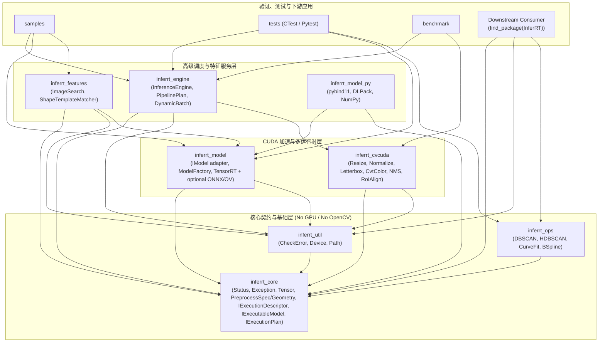
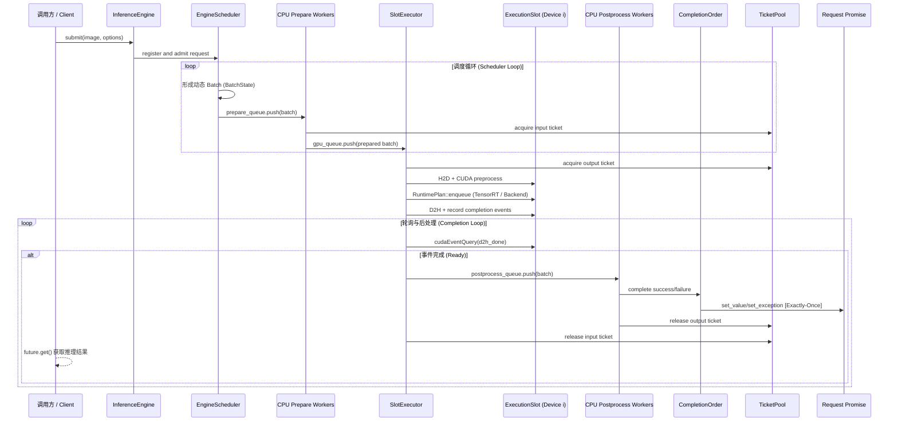
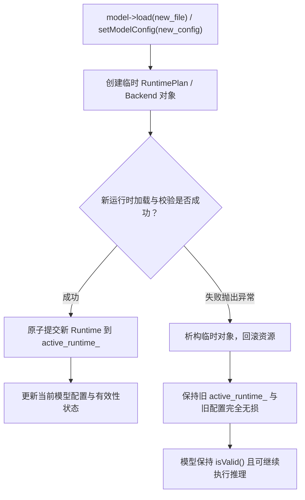
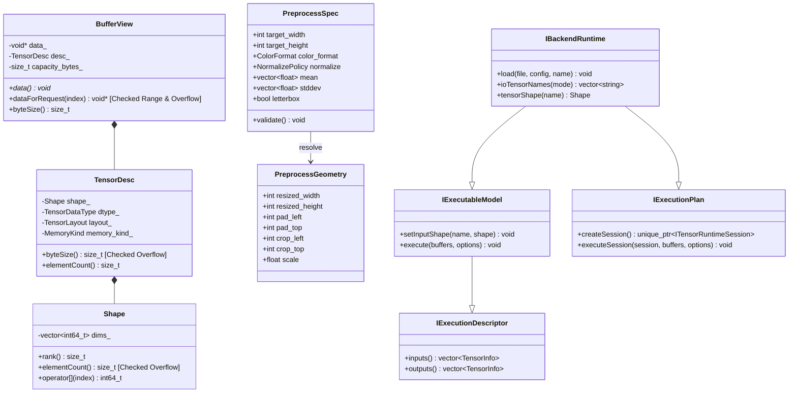

# InferRT 项目架构图谱

本文档补充 `项目总览`，使用 Mermaid 图表直观展示 InferRT 的模块分层、依赖拓扑、Engine 异步调度架构与类契约关系。

架构审查和演进计划见根目录 [`sol_anylysis.md`](../sol_anylysis.md) 与 [`sol_plan.md`](../sol_plan.md)；本文档只维护结构索引与单一事实来源。

## 1. 模块依赖与分层拓扑图

## 2. Engine 异步多设备调度与生命周期架构

## 3. 模型生命周期与强异常安全事务图

## 4. 统一张量契约与单一真相源 (SSOT)

## 5. 源码索引

| 责任边界 | 源码入口 |
| --- | --- |
| Core tensor 与 execution contract | [`src/core/include/inferrt/core/Tensor.hpp`](../src/core/include/inferrt/core/Tensor.hpp)、[`src/core/include/inferrt/core/ModelContract.hpp`](../src/core/include/inferrt/core/ModelContract.hpp) |
| PreprocessSpec 与 geometry SSOT | [`src/core/include/inferrt/core/PreprocessSpec.hpp`](../src/core/include/inferrt/core/PreprocessSpec.hpp) |
| Model facade、公开 runtime contract 与 backend adapters | [`src/model/IModel.cpp`](../src/model/IModel.cpp)、[`src/model/include/inferrt/model/BackendRuntime.hpp`](../src/model/include/inferrt/model/BackendRuntime.hpp)、[`src/model/priv/IModelImpl.cpp`](../src/model/priv/IModelImpl.cpp)、[`src/model/priv/TensorRTBackend.cpp`](../src/model/priv/TensorRTBackend.cpp)、[`src/model/priv/ONNXRuntimeBackend.cpp`](../src/model/priv/ONNXRuntimeBackend.cpp)、[`src/model/priv/OpenVINOBackend.cpp`](../src/model/priv/OpenVINOBackend.cpp) |
| Engine 生命周期编排 | [`src/engine/InferenceEngine.cpp`](../src/engine/InferenceEngine.cpp) |
| Engine legacy 预处理与内置算子 | [`src/engine/priv/EngineLegacyPipeline.cpp`](../src/engine/priv/EngineLegacyPipeline.cpp)、[`src/engine/BuiltinOperators.cpp`](../src/engine/BuiltinOperators.cpp) |
| CUDA 预处理算子 | [`src/cvcuda/OpLetterBox.cpp`](../src/cvcuda/OpLetterBox.cpp)、[`src/cvcuda/OpNormalize.cpp`](../src/cvcuda/OpNormalize.cpp)、[`src/cvcuda/priv/OpCvtColorImpl.cu`](../src/cvcuda/priv/OpCvtColorImpl.cu) |
| Engine scheduler、stage queue、ticket pool 与 slot executor | [`src/engine/priv/EngineScheduler.hpp`](../src/engine/priv/EngineScheduler.hpp)、[`src/engine/priv/EngineStageQueue.hpp`](../src/engine/priv/EngineStageQueue.hpp)、[`src/engine/priv/EngineTicketPool.hpp`](../src/engine/priv/EngineTicketPool.hpp)、[`src/engine/priv/EngineSlotExecutor.hpp`](../src/engine/priv/EngineSlotExecutor.hpp) |
| Engine completion/order、metrics/fault 与 runtime dispatch | [`src/engine/priv/EngineCompletionOrder.hpp`](../src/engine/priv/EngineCompletionOrder.hpp)、[`src/engine/priv/EngineMetricsFault.hpp`](../src/engine/priv/EngineMetricsFault.hpp)、[`src/engine/priv/EngineExecution.cpp`](../src/engine/priv/EngineExecution.cpp)、[`src/engine/priv/EngineRuntimePlan.hpp`](../src/engine/priv/EngineRuntimePlan.hpp)、[`src/engine/priv/TensorRTRuntimePlan.cpp`](../src/engine/priv/TensorRTRuntimePlan.cpp) |
| Clustering validation, distance, neighborhood and tree index | [`src/ops/priv/ClusteringCommon.cpp`](../src/ops/priv/ClusteringCommon.cpp)、[`src/ops/priv/ClusteringDistance.cpp`](../src/ops/priv/ClusteringDistance.cpp)、[`src/ops/priv/ClusteringNeighborhood.cpp`](../src/ops/priv/ClusteringNeighborhood.cpp)、[`src/ops/priv/ClusteringTrees.cpp`](../src/ops/priv/ClusteringTrees.cpp) |
| Faiss index and ROI feature extractor deep modules | [`src/features/priv/ImageSearchFaissIndex.hpp`](../src/features/priv/ImageSearchFaissIndex.hpp)、[`src/features/priv/ImageSearchFaissIndex.cpp`](../src/features/priv/ImageSearchFaissIndex.cpp)、[`src/features/priv/RoiFeatureExtractor.hpp`](../src/features/priv/RoiFeatureExtractor.hpp)、[`src/features/priv/RoiFeatureExtractor.cpp`](../src/features/priv/RoiFeatureExtractor.cpp) |
| Model/Engine contract tests | [`tests/model/TestModelLifecycle.cpp`](../tests/model/TestModelLifecycle.cpp)、[`tests/model/TestONNXModel.cpp`](../tests/model/TestONNXModel.cpp)、[`tests/engine/TestEngineGpu.cpp`](../tests/engine/TestEngineGpu.cpp) |
| Python graph backend and ONNX graph checks | [`tests/python/test_backend_runtime.py`](../tests/python/test_backend_runtime.py)、[`tests/python/test_sam_export_onnx.py`](../tests/python/test_sam_export_onnx.py) |

## 6. 验收索引

当前实现验收见根目录 [`sol_review_18.md`](../sol_review_18.md)，阶段目标与验收标准见 [`sol_plan.md`](../sol_plan.md)。最终证据索引见 [`artifacts/final-validation/full-release-20260902/`](../artifacts/final-validation/full-release-20260902/)。本文档只维护架构索引，不复制实现细节。
