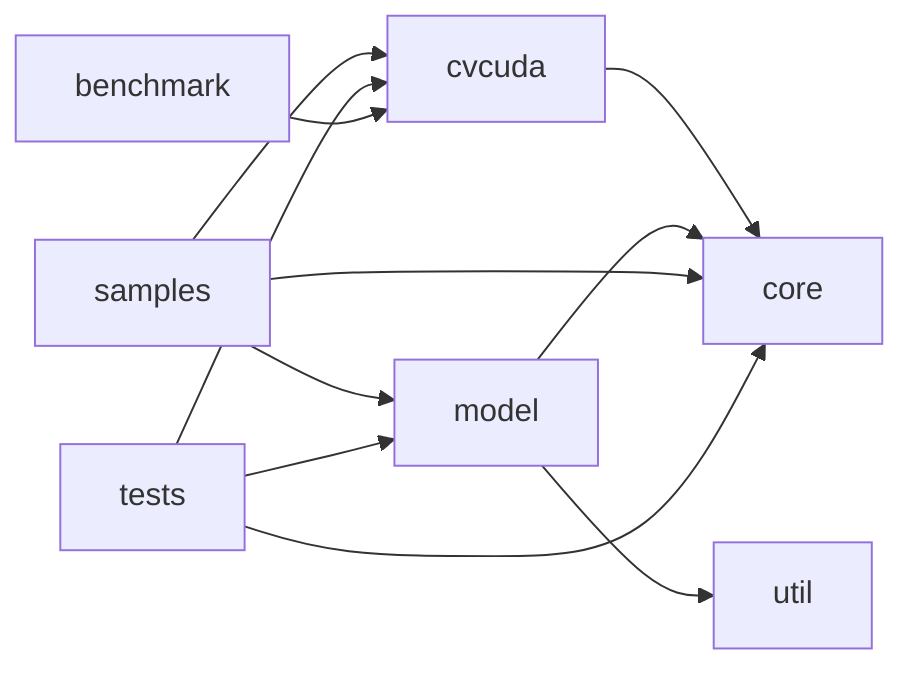
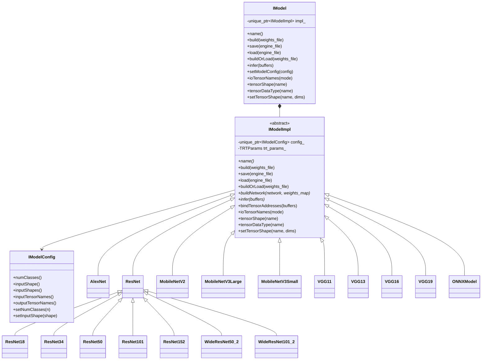
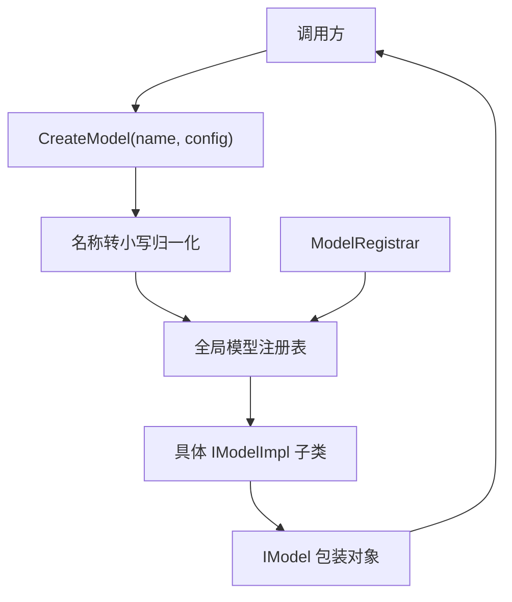
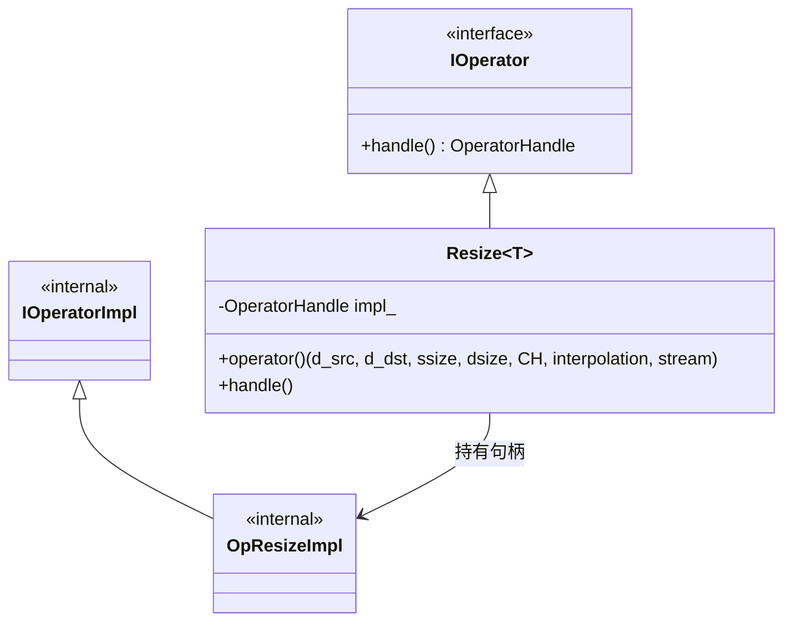
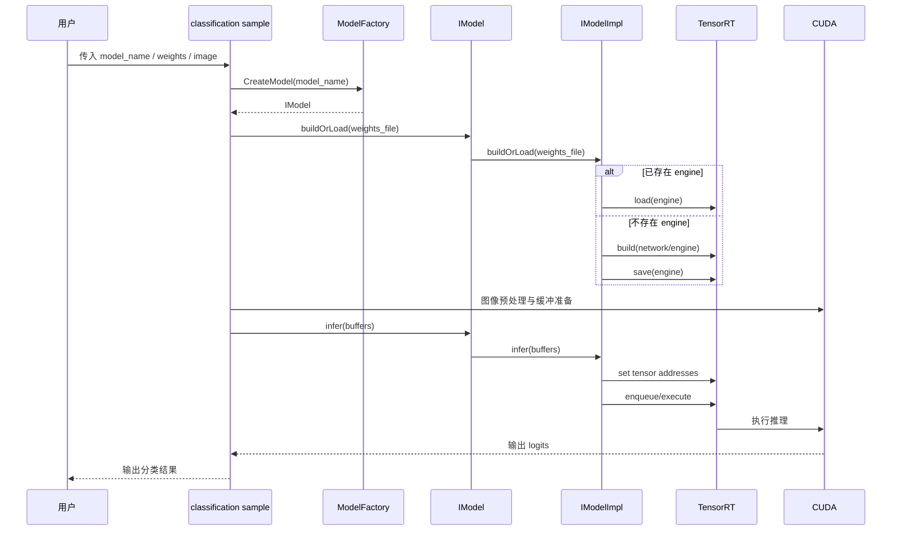
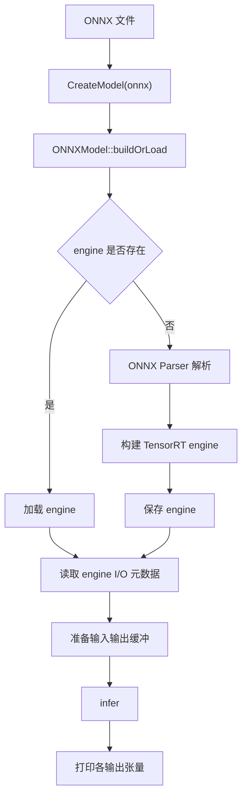
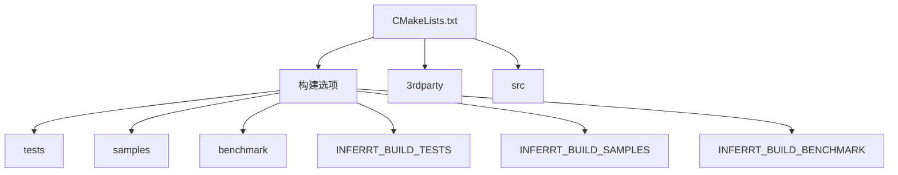
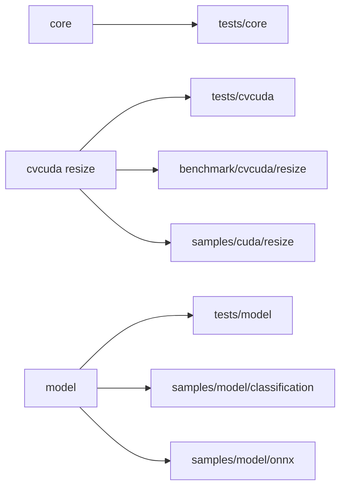
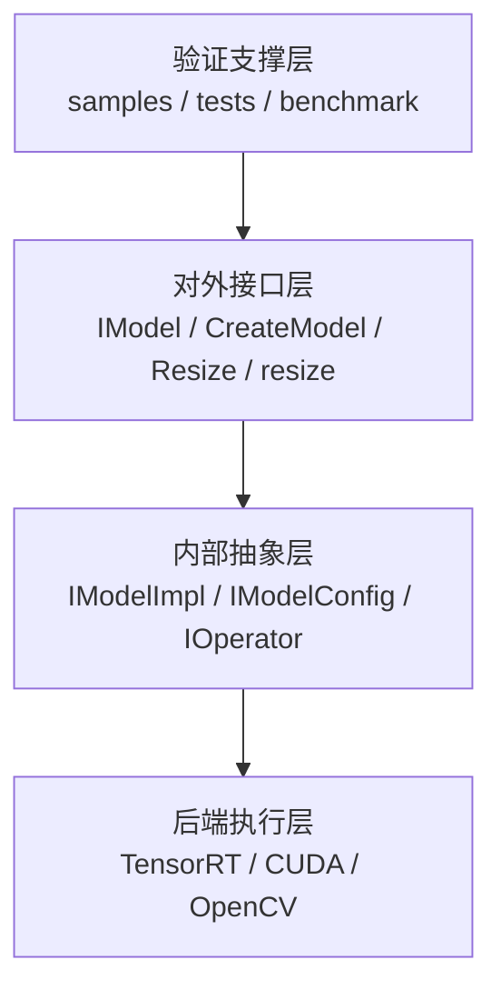

# InferRT 项目架构图谱

本文档用于补充 `项目总览`，重点用图的方式展示当前仓库的结构、模块依赖、类关系、关键流程和测试视角。图使用 Mermaid 编写，便于后续和代码一起维护。

## 1. 仓库结构图

```mermaid
flowchart TD
    Root[InferRT]

    Root --> CMake[cmake/]
    Root --> Src[src/]
    Root --> Samples[samples/]
    Root --> Tests[tests/]
    Root --> Bench[benchmark/]
    Root --> Assets[assets/]
    Root --> Third[3rdparty/]
    Root --> Docs[docs/]
    Root --> Export[InferRT-0.0.1/]

    Src --> Core[src/core]
    Src --> CvCuda[src/cvcuda]
    Src --> Model[src/model]
    Src --> Util[src/util]
    Src --> Common[src/common]

    Samples --> VersionSample[samples/version]
    Samples --> CudaSample[samples/cuda/resize]
    Samples --> ClsSample[samples/model/classification]
    Samples --> OnnxSample[samples/model/onnx]

    Tests --> CoreTest[tests/core]
    Tests --> CvCudaTest[tests/cvcuda]
    Tests --> ModelTest[tests/model]

    Bench --> ResizeBench[benchmark/cvcuda/resize]
```

## 2. 模块依赖图

说明：

- `core` 是公共基础层
- `model` 是 TensorRT 推理封装中心
- `cvcuda` 是 CUDA 算子层
- `samples/tests/benchmark` 分别从使用、验证、性能三个角度围绕核心模块展开

## 3. 模型模块类关系图

## 4. 模型工厂与注册机制图

说明：

- 注册发生在各模型实现编译单元中
- 创建时统一返回 `IModel`
- 调用方不需要直接感知内部实现类

## 5. cvcuda `resize` 类关系图

## 6. 分类模型推理流程图

## 7. ONNX 推理流程图

## 8. 构建系统关系图

## 9. 测试与验证视图

这个视图有一个很直接的结论：`resize` 是当前仓库里验证链路最完整的能力点，而 `model` 则是功能面最广的业务中心。

## 10. 关注点分层图

## 11. 现在最值得继续补的图

如果后续文档继续扩展，我建议优先再补这几类图：

1. 新增模型接入时序图  
   说明从 `*.hpp/*.cpp`、注册、样例、测试到权重导出脚本的完整接入步骤。
2. `resize` 数据路径图  
   说明 host/device、输入输出布局、插值与 stream 的关系。
3. 发布产物图  
   说明 `include/`、导出库、样例二进制和安装目录之间的关系。
4. 依赖版本兼容矩阵图  
   说明 CUDA、TensorRT、OpenCV 与编译器版本的推荐组合。

## 12. 一句话总结

InferRT 当前的最佳理解方式不是“几个样例程序”，而是“一个以 TensorRT 模型封装为中心、以 CUDA 图像算子为扩展方向、同时具备测试和基准支撑的推理基础库骨架”。
