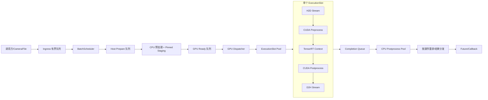

# InferRT Engine 模块设计方案

> 实现状态（2026-07-26）：C++ DAG/Registry、动态组批、优先级与 compatibility-key 调度、多 Context/stream、
> 独立 CPU prepare、GPU dispatcher、completion poller、CPU postprocess、Pinned input/output ticket pool、每 Slot
> `cudaMallocAsync` DeviceArena、静态 batch padding、deadline/cancel/backpressure、阶段延迟与资源高水位指标均已落地。
> 本轮补齐了命名多输入绑定、每 GPU 独立 TensorRT runtime/slot 轮转、Pinned/Device 预分配上限、按 source 的有序
> future 交付，以及有界故障记录；GPU 自动化测试现场构建 TensorRT 小网络验证这些路径。暂不实现任意动态 shape、
> 故障恢复、DLPack/GpuMat 输入、CUDA Graph、INT8 与 Nsight/NVTX 可观测性。

## 1. 文档目标

本文在 `CUDA_TensorRT_CV_Inference_Framework_Design.md` 的总体方案上，结合 InferRT 当前的 `core`、`model`、`cvcuda`、`ops`、`features`、测试、样例和 benchmark 结构，设计一个新的 `engine` 模块。

`engine` 的定位是部署运行时编排层：它不替代 `model` 的模型构建与单次推理能力，而是在其上提供配置驱动的前后处理、动态组批、异步数据传输、多执行上下文、跨 batch 流水线、资源池、背压、结果分发和运行指标。

本文只描述设计，不包含代码修改。

## 2. 设计优先级

首版优先完成以下能力：

1. OpenCV `cv::Mat` 输入和命名 Tensor 输入。
2. 配置驱动的 CPU/CUDA 前后处理流水线。
3. 动态 BatchScheduler。
4. Pinned Host Memory、异步 H2D/D2H 和设备内存复用。
5. 一个共享 TensorRT engine、多个独立 Execution Context。
6. 多执行槽、多 CUDA Stream，以及跨 batch 的传输/计算重叠。
7. 有界队列、背压、超时、取消和安全停机。
8. 同步/异步公共 API。
9. 与普通 `IModel` 调用可直接对比的 sample 和 benchmark。
10. 可测试、可观测、可逐阶段落地。

CUDA Graph 不属于首版重点。首版所有接口和内存地址应避免阻碍未来接入 CUDA Graph，但不以 Graph capture、Graph cache 或 Graph 性能作为当前实现和验收条件。

## 3. InferRT 现状与设计约束

### 3.1 可直接复用的现有能力

| 现有模块 | 可复用能力 | `engine` 中的用途 |
|---|---|---|
| `core` | `irt::Status`、`irt::Exception` | 统一错误传播 |
| `model` | `CreateModel`、`IModelConfig`、模型注册、engine 构建/加载、动态 batch profile、张量元数据 | 模型制品准备和后端适配 |
| `model` | `IModel::infer(..., stream, true)` | 单执行槽适配和过渡实现 |
| `cvcuda` | Resize、LetterBox、CvtColor、NMS、RoIAlign 等 stream-aware CUDA 算子 | CUDA 算子节点实现 |
| `ops` | CPU 算法和后处理基础能力 | CPU 后处理节点实现 |
| `util` | CUDA 检查、文件与路径工具 | 配置、资源和错误处理 |
| `3rdparty/yaml-cpp` | YAML 解析 | EngineConfig 加载 |
| tests/benchmark | GoogleTest、Google Benchmark、CUDA Event 计时范式 | engine 验证与性能对照 |

### 3.2 当前能力缺口

当前 `IModel` 内部的 TensorRT 运行时只持有一个 `IExecutionContext`，并会在推理前修改输入 shape 和 tensor address。一个 `IModel` 实例不能被多个线程并发调用，也不能把同一个 context 同时提交到多个 stream。

当前 `DeviceBuffer` 使用 `cudaMalloc/cudaFree`，`HostBuffer` 使用普通 `malloc/free`。它们适合普通调用和样例，但不满足高吞吐热路径对稳定显存、Pinned Memory 和无逐帧分配的要求。

现有 `cvcuda` 算子已经接受外部 stream，但多数公开接口面向单张图。首版可以在同一 stream 上逐图 enqueue；后续再增加 fused/batched kernel，不应等待批量算子完成后才建设 engine。

当前没有通用的 OperatorRegistry、PipelineBuilder、BatchScheduler、有界队列、ContextPool、PinnedPool、流水线执行槽和异步结果接口。

### 3.3 必须遵守的并发约束

- 一个 TensorRT `IExecutionContext` 同一时刻只处理一个 batch。
- context 的 `setInputShape`、`setTensorAddress` 和 `enqueueV3` 必须由其所属执行槽串行完成。
- 多个 context 可以共享一个只读 `ICudaEngine`。
- 每个工作线程进入 CUDA 路径前必须设置正确的 device。
- 热路径不允许调用 `cudaMalloc/cudaFree`、`cudaHostAlloc/cudaFreeHost` 或全设备同步。
- CPU 后处理不能占用 TensorRT context；D2H 完成后应尽早释放 GPU 执行槽。
- 异步输入的所有权必须明确，不能在调用方已经释放或修改 `cv::Mat` 后继续读取其数据。

## 4. 模块边界

新增命名空间和库：

```text
namespace irt::engine
library   inferrt_engine
target    InferRT::engine
```

职责划分如下：

```text
model
  负责模型定义、权重转换、TensorRT engine 构建/加载、模型元数据
                         │
                         ▼
engine
  负责请求、组批、流水线、资源池、并发执行、传输、结果和指标
                         │
            ┌────────────┴────────────┐
            ▼                         ▼
         cvcuda                      ops
      CUDA 前后处理                CPU 算法
```

`features` 等高级模块可以逐步选择使用 `engine`，但 `engine` 不依赖 `features`，避免循环依赖。

## 5. 总体架构



这里包含两种“流水线”：

1. 单 batch 内的数据依赖流水线：H2D → CUDA preprocess → TensorRT → CUDA postprocess → D2H → CPU postprocess。
2. 多 batch 间的并行流水线：Batch N 在计算时，Batch N+1 可以做 H2D，Batch N-1 可以做 D2H/CPU 后处理。

吞吐提升主要来自第二种流水线，而不是简单地把所有节点放进一个同步函数。

实现中 GPU dispatcher 只建立 stream/event 依赖；completion poller 在 H2D event 完成后归还输入 ticket，在
D2H event 完成后立即归还 ExecutionSlot，并把输出 ticket 投递给 CPU postprocess worker。因此 CPU 后处理不会
占用 TensorRT context，GPU 提交线程也不会等待 D2H。

## 6. 建议目录结构

```text
src/engine/
  CMakeLists.txt
  include/inferrt/engine/
    EngineConfig.hpp
    InferenceEngine.hpp
    Request.hpp
    Result.hpp
    Tensor.hpp
    Operator.hpp
    OperatorRegistry.hpp
    Metrics.hpp
  priv/
    InferenceEngineImpl.hpp/.cpp
    ConfigLoader.hpp/.cpp
    BoundedQueue.hpp
    BatchScheduler.hpp/.cpp
    PipelineBuilder.hpp/.cpp
    PipelinePlan.hpp/.cpp
    ExecutionSlot.hpp/.cpp
    ExecutionSlotPool.hpp/.cpp
    RuntimePlan.hpp
    TensorRTRuntimePlan.hpp/.cpp
    ModelRuntimeAdapter.hpp/.cpp
    DeviceMemoryPool.hpp/.cpp
    PinnedMemoryPool.hpp/.cpp
    CompletionPoller.hpp/.cpp
    ResultReorderBuffer.hpp/.cpp
    operators/
      RegisterBuiltinOperators.cpp
      ResizeCudaOp.cpp
      LetterBoxCudaOp.cpp
      CvtColorCudaOp.cpp
      NormalizeCudaOp.cu
      LayoutCudaOp.cu
      NmsCudaOp.cpp
      ClassificationCpuOp.cpp
      DetectionDecodeCudaOp.cu
      DetectionDecodeCpuOp.cpp

tests/engine/
samples/engine/
benchmark/engine/
```

构建顺序建议为：

```text
core -> cvcuda/util/model/ops -> engine -> features/python
```

`inferrt_engine` 至少链接 `inferrt_core`、`inferrt_util`、`inferrt_model`、`inferrt_cvcuda`、`inferrt_ops`、`opencv_core`、`CUDA::cudart`、TensorRT 和 `yaml-cpp::yaml-cpp`。

## 7. 公共数据模型

### 7.1 Tensor 描述

`engine` 的公共 Tensor 类型不直接使用 `nvinfer1::DataType`，避免前后处理和未来非 TensorRT 后端被 TensorRT 类型锁死。

```cpp
enum class DataType { UInt8, Int32, Int64, Float16, Float32 };
enum class MemoryKind { Host, HostPinned, CudaDevice };
enum class Layout { Unknown, HWC, NHWC, CHW, NCHW };

struct TensorDesc {
    std::string name;
    DataType dtype;
    std::vector<int64_t> shape;
    Layout layout{Layout::Unknown};
    MemoryKind memory{MemoryKind::Host};
};

struct TensorView {
    TensorDesc desc;
    void* data{nullptr};
    size_t bytes{0};
    int device_id{-1};
};

// 公共 API 使用有所有权的 Tensor；TensorView 只在 engine 内部短暂借用。
class ITensorStorage {
public:
    virtual ~ITensorStorage() = default;
    virtual void* data() noexcept = 0;
    virtual size_t bytes() const noexcept = 0;
    virtual MemoryKind memoryKind() const noexcept = 0;
    virtual int deviceId() const noexcept = 0;
};

struct Tensor {
    TensorDesc desc;
    std::shared_ptr<ITensorStorage> storage;
    size_t offset_bytes{0};
    size_t bytes{0};
};

using TensorMap = std::unordered_map<std::string, Tensor>;
using TensorViewMap = std::unordered_map<std::string, TensorView>;
```

TensorRT 适配层负责 `DataType` 与 `nvinfer1::DataType` 的双向转换。

请求和响应中的 Tensor 必须持有 `ITensorStorage`，确保异步执行或结果离开内部 pool 后数据仍然有效。Pipeline 热路径使用不拥有内存的 `TensorViewMap`，其生命周期由对应 ticket/arena 严格限定。

### 7.2 请求

```cpp
using RequestId = uint64_t;

struct ImageFrame {
    std::shared_ptr<const cv::Mat> image;
    uint64_t source_id{0};
    uint64_t sequence{0};
    std::chrono::steady_clock::time_point timestamp;
};

struct InferenceRequest {
    RequestId id{0};
    std::vector<ImageFrame> images;
    TensorMap extra_inputs;
    std::unordered_map<std::string, std::string> metadata;
};

struct RequestOptions {
    std::optional<std::chrono::steady_clock::time_point> deadline;
    int priority{0};
    bool preserve_source_order{true};
};
```

异步接口默认使用共享所有权。便捷的 `submit(const cv::Mat&)` 必须在返回前复制或克隆数据；零拷贝共享接口则要求调用方传入 `shared_ptr<const cv::Mat>` 并保证底层像素不再被修改。

后续可增加 `CudaImageView`/DLPack 输入路径，直接接收 GPU 驻留数据并跳过 H2D，但不影响首版接口分层。

### 7.3 结果

```cpp
struct Classification {
    std::vector<int> class_ids;
    std::vector<float> scores;
};

struct Detection {
    cv::Rect2f box;
    int class_id;
    float score;
};

using ResultPayload = std::variant<
    TensorMap,
    Classification,
    std::vector<Detection>
>;

struct InferenceResponse {
    RequestId id;
    irt::Status status;
    std::string message;
    ResultPayload payload;
    std::unordered_map<std::string, std::string> metadata;
};
```

首版保留 `TensorMap` 作为通用逃生舱。分类、检测等常见结果使用稳定类型，不通过 `shared_ptr<void>` 或跨动态库的 `std::any` 传递。

## 8. 公共 API

```cpp
enum class ShutdownMode { Drain, CancelPending };

class RequestHandle {
public:
    RequestId id() const noexcept;
    bool cancel();
    bool waitFor(std::chrono::milliseconds timeout) const;
    InferenceResponse get();
};

class InferenceEngine {
public:
    static std::unique_ptr<InferenceEngine> fromYaml(const std::string& path);
    static std::unique_ptr<InferenceEngine> create(EngineConfig config);

    virtual ~InferenceEngine() = default;

    virtual void start() = 0;
    virtual RequestHandle submit(InferenceRequest request,
                                 RequestOptions options = {}) = 0;

    // 同步入口复用 submit + wait，不维护另一套执行逻辑。
    virtual InferenceResponse infer(InferenceRequest request,
                                    std::chrono::milliseconds timeout) = 0;

    virtual void shutdown(ShutdownMode mode = ShutdownMode::Drain) = 0;
    virtual EngineMetricsSnapshot metrics() const = 0;
};
```

回调 API 可以作为 `submit` 的重载提供，但回调必须在专用 completion executor 中执行，不能在 CUDA host callback、调度线程或持有资源池锁时调用用户代码。

## 9. 配置设计

### 9.1 C++ DAG 定义示例

Pipeline 不使用 YAML/JSON 描述。模型制品、batch 和运行时参数可以由应用自行构造 `EngineConfig`；算子、张量和边全部
通过 C++ API 定义：

```cpp
auto registry = std::make_shared<OperatorRegistry>();
registerBuiltinOperators(*registry);
registry->registerCreator("application.detector_post.cuda", makeDetectorPostCreator());

PipelineBuilder builder;
builder
    .addTensor("host_bgr", {TensorDataType::U8, TensorLayout::HWC, MemoryKind::HOST, 768, 576, 3})
    .addTensor("device_bgr", {TensorDataType::U8, TensorLayout::HWC, MemoryKind::DEVICE, 768, 576, 3})
    .addTensor("images", {TensorDataType::F32, TensorLayout::NCHW, MemoryKind::DEVICE, 640, 640, 3})
    .addNode("cpu.copy_image", {{}, {"host_bgr"}, {}})
    .addNode("cuda.upload", {{"host_bgr"}, {"device_bgr"}, {}})
    .addNode("cvcuda.letterbox", {{"device_bgr"}, {"images"}, {}})
    .setModelInput("images");

const auto plan = builder.build(registry);
auto engine = InferenceEngine::create(config, plan);
```

后处理节点可以使用 `model.<output_name>` 作为输入，在 CUDA post 阶段处理模型 device output，或在 CPU post
阶段读取 D2H 后的 output 并修改 `InferenceResult::outputs`。模型相关 Decode/NMS 不进入 engine 内置注册表；应用
可注册调用 `cvcuda::NMS` 等现有 GPU 算子的自定义 Operator。新的 device tensor 通过 `addResult()` 声明，Engine
会自动 D2H 并以 `result.<name>` 供 CPU post 读取。如需改变算子链，应用重新定义并编译新的 DAG，再用新 Plan 创建
新 Engine；不会在运行中的 Engine 中动态增删节点。

### 9.2 Builder 校验原则

PipelineBuilder 在编译时完成节点类型、张量、拓扑和阶段校验；模型加载后再校验 Plan 的 model input 与 TensorRT input。

必须校验：

- 注册表是否已冻结、算子 type 是否存在、张量名是否重复。
- 模型 key、制品路径、运行设备和后端是否可用。
- batching 范围是否落在 TensorRT optimization profile 范围内。
- pipeline 每个输入端口是否有唯一来源。
- 节点 dtype、layout、shape、memory kind 是否兼容。
- TensorRT I/O 名称、数量、dtype 和 shape 是否与配置一致。
- `execution_slots`、Pinned slot 数、队列容量是否为正并满足最小资源关系。
- 静态 batch engine 在 partial batch 下必须显式选择 padding 或 reject。
- 最大输入尺寸能否装入预分配 staging/device arena。

禁止静默修正关键配置。无法确认的 shape、layout 或数据类型应在 `start()` 前报错。

## 10. Pipeline 抽象

### 10.1 从算子链升级为有类型的数据流图

preprocess/postprocess 均由代码定义为有向无环图。这样能支持 SAM 多输入、检测多输出、共享中间张量和后续分支。

```cpp
enum class ExecutionKind { Cpu, Cuda };

struct OperatorContract {
    std::vector<TensorDesc> inputs;
    std::vector<TensorDesc> outputs;
    ExecutionKind kind;
    bool in_place{false};
    bool thread_safe{false};
    size_t scratch_bytes{0};
};

struct OperatorContext {
    int device_id;
    int actual_batch;
    cudaStream_t stream;
    TensorViewMap& tensors;
    BatchMetadata& metadata;
    ScratchAllocator& scratch;
};

class IOperator {
public:
    virtual ~IOperator() = default;
    virtual OperatorContract contract() const = 0;
    virtual void prepare(const PrepareContext&) = 0;
    virtual void execute(OperatorContext&) = 0;
};
```

CUDA 节点的 `execute` 只 enqueue，不做 stream synchronize。CPU 节点在对应 CPU worker 中执行。

### 10.2 PipelineBuilder

`PipelineBuilder` 在启动阶段完成：

1. 从 Registry 创建节点。
2. 解析命名端口并做拓扑排序。
3. 推导 dtype/layout/shape/memory kind。
4. 将整个图切分为 CPU preprocess、CUDA preprocess、TensorRT、CUDA postprocess、CPU postprocess 五类执行段。
5. 根据张量生命周期做 buffer liveness 分析。
6. 为每个 ExecutionSlot 生成固定的 device arena layout 和 scratch layout。
7. 生成不可变 `PipelinePlan`，运行时不再解析 YAML 或分配节点。

CPU 节点如果出现在两个 CUDA 节点之间，会造成 D2H→CPU→H2D。Builder 要求调用方显式加入传输节点，不能自动隐藏昂贵的数据往返。

### 10.3 现有 cvcuda 算子适配

首版通过 adapter 复用当前算子：

- `cvcuda.resize`
- `cvcuda.letterbox`
- `cvcuda.cvt_color`
- `cvcuda.normalize`

`cvcuda.nms`、`cvcuda.roi_align` 等模型相关算子由应用注册成自己的后处理节点，而不是由 engine 默认绑定模型语义。

如果算子只支持单图，adapter 按 batch 中的有效图像在同一 compute stream 上逐个 enqueue。由于没有中间同步，这仍能保持异步流水线。`Normalize` 保持独立节点；后续可在不改变 DAG 语义的前提下，用等价实现替换热点节点组合。

### 10.4 OperatorRegistry

```cpp
using OperatorCreator = std::function<std::unique_ptr<IOperator>(const NodeConfig&)>;

class OperatorRegistry {
public:
    bool registerCreator(std::string type, OperatorCreator creator);
    void freeze();
    std::unique_ptr<IOperator> create(std::string_view type,
                                      const NodeConfig& config) const;
    std::vector<std::string> types() const;
};
```

设计要求：

- Registry 使用具体 `IOperator` 类型，不使用 `shared_ptr<void>`。
- 内置算子通过 `registerBuiltinOperators()` 显式注册，避免静态库裁剪导致注册对象丢失。
- `PipelineBuilder::build()` 后 Registry 冻结，只读创建；新 DAG 可复用既有类型，但不能向冻结 Registry 追加类型。
- 重名注册默认失败，不能静默覆盖。
- 持有 scratch 或 CUDA handle 的算子实例按 ExecutionSlot 创建；明确声明线程安全的无状态 CPU 算子才允许共享。

## 11. 数据流水线

### 11.1 流水线阶段

完整热路径如下：

```text
submit
  │
  ├─ 1. Ingress Queue
  ├─ 2. BatchScheduler
  ├─ 3. CPU validate/prepare
  ├─ 4. copy/convert into PinnedInputTicket
  ├─ 5. async H2D on h2d_stream
  ├─ 6. CUDA preprocess on compute_stream
  ├─ 7. TensorRT enqueueV3 on compute_stream
  ├─ 8. CUDA postprocess on compute_stream
  ├─ 9. async D2H on d2h_stream
  ├─10. CPU postprocess
  ├─11. optional source-order reorder
  └─12. fulfill Future / invoke callback
```

阶段之间使用有界队列传递带所有权的 ticket，任何阶段变慢都会通过背压向上游传播，不能无限堆积请求。

### 11.2 CUDA Event 依赖

单个 ExecutionSlot 建议拥有三个 non-blocking stream：

- `h2d_stream`：输入异步传输。
- `compute_stream`：CUDA preprocess、TensorRT、CUDA postprocess。
- `d2h_stream`：结果异步传输。

依赖关系：

```text
h2d_stream:     H2D ---------------- record(h2d_done)
                                           │
compute_stream:             wait(h2d_done) ├─ preprocess -> TRT -> post -> record(gpu_done)
                                                                                      │
d2h_stream:                                                       wait(gpu_done) ------┴─ D2H -> record(d2h_done)
```

GPU 提交线程只建立 event 依赖，不执行 `cudaEventSynchronize` 或 `cudaDeviceSynchronize`。`CompletionPoller` 使用 `cudaEventQuery` 检查 H2D/D2H 完成，或使用只负责投递轻量 token 的 CUDA host function。CUDA host function 中禁止运行用户回调、CPU 后处理或调用 CUDA API。

### 11.3 多 batch 重叠示意

```text
时间 ─────────────────────────────────────────────────────────────>

Batch 0:  CPU Prep | H2D | CUDA Pre + TRT + CUDA Post | D2H | CPU Post
Batch 1:           CPU Prep | H2D | CUDA Pre + TRT + CUDA Post | D2H | CPU Post
Batch 2:                    CPU Prep | H2D | CUDA Pre + TRT + CUDA Post | D2H | CPU Post
```

实际是否重叠取决于 GPU copy engine、kernel 占用率、batch 大小和 host worker 数量。架构必须允许重叠，具体参数由 benchmark 和 Nsight Systems 调优。

### 11.4 Ticket 与资源释放时机

- `PinnedInputTicket`：CPU prepare 获取；H2D event 完成后即可回池。
- `ExecutionSlotLease`：GPU dispatcher 获取；D2H 已提交且 context 不再被使用后，在 `d2h_done` 完成时回池。
- `PinnedOutputTicket`：D2H 前获取；CPU postprocess 完成后回池。
- `BatchState`：从组批开始持有各 request 的 promise、metadata 和 valid mask，直到所有结果完成或取消。

Pinned input/output pool 与 ExecutionSlotPool 分离，避免 CPU 准备或 CPU 后处理长期占用 TensorRT context。

## 12. BatchScheduler

### 12.1 组批键

只有兼容请求可以进入同一 batch。建议 key 至少包含：

```text
(engine generation,
 model input shape/profile,
 pipeline fingerprint,
 input dtype/layout,
 result type,
 priority class)
```

不同原图宽高可以在同一 batch，只要 preprocess 支持逐图尺寸并最终生成同一个模型输入 shape。

### 12.2 触发条件

满足任一条件即发出 batch：

1. 达到 `max_batch`。
2. 达到最大的 preferred batch，且没有必要继续等待。
3. 最老请求等待时间达到 `max_wait_us`。
4. 最早 deadline 减去预测执行时间已经到达。
5. engine 进入 Drain 状态。

`max_wait_us` 从该兼容队列中第一个请求入队时开始计算，不能在后续请求到达时重置。

### 12.3 动态与静态 batch

- 动态 batch engine：为实际 batch 设置 N 维，N 必须位于 TensorRT profile 的 min/max 范围内。
- 静态 batch engine：不足 batch 时只允许显式 `pad` 或 `reject`。
- padding 默认复制最后一个有效样本或填零，结果依靠 `valid_count`/`valid_mask` 丢弃填充项。
- `preferred_batches` 只影响吞吐优化，不得违反 deadline。

### 12.4 公平性与顺序

- Scheduler 对兼容队列使用加权轮询，避免高流量 source 饿死低流量 source。
- 每个 source 维护单调 sequence。
- GPU batch 可以乱序完成；`ResultReorderBuffer` 只在 `preserve_source_order=true` 时按 source 重排。
- 全局顺序不是默认保证，因为它会让互不相关的摄像头相互阻塞。

## 13. TensorRT RuntimePlan 与 ExecutionSlot

### 13.1 不直接并发共享当前 IModel

禁止在多个线程上并发调用同一个现有 `IModel` 实例。其内部只有一个 context，且 tensor shape/address 是可变状态。

目标架构引入内部后端接口：

```cpp
class IRuntimePlan {
public:
    virtual ~IRuntimePlan() = default;
    virtual const std::vector<TensorDesc>& inputs() const = 0;
    virtual const std::vector<TensorDesc>& outputs() const = 0;
    virtual std::unique_ptr<IExecutionSession> createSession() const = 0;
};

class IExecutionSession {
public:
    virtual ~IExecutionSession() = default;
    virtual void setInputShapes(const TensorViewMap& inputs) = 0;
    virtual void enqueue(const TensorViewMap& bindings, cudaStream_t stream) = 0;
};
```

`TensorRTRuntimePlan` 持有一个共享、只读的 `ICudaEngine`；每个 `TensorRTExecutionSession` 持有自己的 `IExecutionContext`。所有 session 从同一个 plan 创建。

### 13.2 与 model 模块的衔接

单 GPU 时，`TensorRTRuntimePlan` 在启动时反序列化一次最终 `.engine`，并为每个 ExecutionSlot 创建独立
`IExecutionContext`。多 GPU 时每个 device 都有独立 RuntimePlan（TensorRT engine/context 不跨 device 共享），slot
按 `EngineConfig::device_ids` 轮转分配；模型制品仍可由普通 `IModel::buildOrLoad` 负责准备。

### 13.3 ExecutionSlot

```cpp
struct ExecutionSlot {
    size_t id;
    int device_id;
    std::unique_ptr<IExecutionSession> session;
    CudaStream h2d_stream;
    CudaStream compute_stream;
    CudaStream d2h_stream;
    CudaEvent h2d_done;
    CudaEvent gpu_done;
    CudaEvent d2h_done;
    DeviceArena device_arena;
    ScratchArena scratch_arena;
    std::vector<std::unique_ptr<IOperator>> slot_operators;
};
```

使用一个聚合的 `ExecutionSlotPool`，而不是分别借出 ContextPool 和 StreamPool。聚合租约能避免 context、stream、buffer 被错误配对，也避免分别获取多个池导致的死锁。

`ExecutionSlotLease` 使用 RAII。正常完成、异常、取消和 shutdown 都必须走同一释放路径。

## 14. 内存与数据传输

### 14.1 PinnedMemoryPool

`cv::Mat` 通常位于 pageable memory，直接传给 `cudaMemcpyAsync` 不保证真正异步。CPU prepare 阶段需要把数据复制/转换到 `cudaHostAlloc` 或 `cudaHostRegister` 管理的 staging block。

Pinned pool 采用固定数量、按容量分级的 slab：

```text
PinnedInputPool  -> 原图/CPU preprocess 输出
PinnedOutputPool -> GPU 输出和小型结果结构
```

Pool 在 `start()` 阶段分配，在 `shutdown()` 最后释放。Pinned memory 会占用不可换页物理内存，必须通过配置严格设上限。

### 14.2 DeviceMemoryPool

每个 ExecutionSlot 在 warmup 阶段获得稳定的 DeviceArena。PipelineBuilder 根据最大 batch、最大 shape 和张量生命周期为 arena 分配 offset，实现中间 buffer 复用。

推荐使用 CUDA 默认或私有 `cudaMemPool_t`，通过 `cudaMallocAsync` 在初始化 stream 上完成 arena 分配，初始化结束后同步一次。热路径只取 arena 中的 view，不再分配。

对超过配置上限的输入：

- 实时服务默认拒绝，返回明确状态。
- 可选 `allow_oversize_slow_path=true` 才允许进入慢路径动态扩容。
- 慢路径必须单独计数，不能悄悄破坏延迟目标。

### 14.3 Buffer 生命周期分析

PipelineBuilder 为每个逻辑 tensor 记录首次/最后使用节点。生命周期不重叠且对齐要求兼容的 tensor 可以复用同一 arena 区域。

模型输入/输出地址在一个 ExecutionSlot 生命周期内保持稳定，有利于 TensorRT 地址绑定缓存，也为未来可选 CUDA Graph 留出空间。

### 14.4 数据输入优化顺序

1. 首版：`cv::Mat` → Pinned → Device。
2. 增强：支持调用方提供的已注册 Pinned buffer。
3. 增强：支持 `cv::cuda::GpuMat` 或 DLPack GPU tensor，记录生产者 event 后零拷贝接入 compute stream。
4. 多 GPU：校验输入 device；必要时显式 peer copy，不做隐式跨 GPU 访问。

## 15. 背压、超时与取消

所有队列必须有界。可配置策略：

| 策略 | 行为 | 适用场景 |
|---|---|---|
| `block` | submit 等待队列空间，受调用超时控制 | 离线批处理 |
| `reject` | 立即返回 queue-full | 在线服务默认 |
| `drop_oldest` | 丢弃最老未执行请求 | 实时视频 |
| `drop_newest` | 丢弃新请求 | 必须保留历史帧的场景 |

取消是 best-effort：

- 尚未组批：直接从等待队列移除。
- 已组批但未提交 GPU：标记无效，必要时保持 batch shape 并忽略结果。
- 已提交 GPU：不尝试中断 kernel；完成后丢弃该 request 的结果并回收资源。

请求 deadline 包含排队、组批、执行和后处理时间。超时响应必须与资源回收解耦：调用方可以先收到 timeout，但后台仍需安全等待 GPU 完成再释放对应资源。

## 16. 线程模型

当前线程组成：

```text
1 x Scheduler thread
N x Host prepare workers
1 x GPU dispatcher（按空闲 slot 跨 device 分派）
1 x Completion poller（轮询各 device 的 event 前设置对应 device）
M x CPU postprocess workers
1 x Completion/callback executor（可与 CPU post pool 合并但不持资源锁）
```

关键规则：

- Scheduler 不执行耗时预处理。
- GPU dispatcher 只做 shape/binding、event 依赖和 enqueue，不能等待 GPU。
- Completion poller 只推进状态和归还资源。
- CPU post worker 不持有 ExecutionSlot。
- 用户 callback 不在内部锁内运行。
- 每个 CUDA 线程启动时调用 `cudaSetDevice(device_id)`。

## 17. 生命周期与故障处理

Engine 状态机：

```text
Created -> Starting -> Running -> Draining -> Stopped
                    \-> Failed --------------^
```

`start()` 顺序：

1. 冻结配置和 Registry。
2. 准备或加载模型制品。
3. 创建 RuntimePlan 并读取真实 I/O metadata/profile。
4. 编译 PipelinePlan。
5. 规划并分配 Pinned/Device 内存。
6. 创建 ExecutionSlot/context/stream/event/operator。
7. 进行必要 warmup。
8. 启动 worker，切换到 Running。

`shutdown(Drain)` 顺序：

1. 停止接受新请求。
2. Scheduler flush partial batch。
3. 等待所有阶段队列排空。
4. 等待所有 in-flight event 完成。
5. 完成 promise/callback。
6. 停止线程。
7. 销毁 context，再销毁 stream/event、device pool、pinned pool、engine。

可恢复的单请求错误只失败该请求或 batch；CUDA context lost、engine enqueue 持续失败、内部队列状态损坏等不可恢复错误使 Engine 进入 Failed，并完成所有未决请求，不能留下永不完成的 future。

当前实现不做 context 重建或自动重试，但 `faults()` 返回有界的 `FaultRecord` 历史。记录包含时间、request id、source id/
sequence、device、阶段、`irt::Status`、fatal 标记和原始错误文本，可将失败结果准确对应回输入并用于离线排查。

## 18. 普通调用与 Engine 调用关系

项目保留两种公开使用层级：

### 18.1 普通 IModel 调用

适合单次推理、显存由调用方管理、外部已有 CUDA pipeline、调试或极简集成：

```cpp
auto model = irt::model::CreateModel("resnet18", std::move(config));
model->load("resnet18.engine");
model->infer(buffers, stream, true);
```

### 18.2 Engine 调用

适合 OpenCV 输入、持续流量、动态组批、自动前后处理、资源复用和多并发：

```cpp
auto engine = irt::engine::InferenceEngine::create(config, plan);
engine->start();

auto handle = engine->submit(makeRequest(frame));
auto result = handle.get();

engine->shutdown();
```

同步 `engine->infer()` 仍走同一调度和流水线路径，只是调用线程等待 RequestHandle。不能另写一套同步推理实现，否则 sample、benchmark 和生产路径会产生行为差异。

## 19. Sample 设计

### 19.1 目标

Sample 必须同时展示普通调用和 engine 调用，且能观察流水线带来的吞吐变化，并展示 C++ DAG 的构建方式。

### 19.2 建议样例

```text
samples/engine/
  README.md
  EngineExample.hpp        # C++ EngineConfig 与 PipelineBuilder 定义
  SampleEngine.cpp
```

#### `inferrt_sample_engine_classification`

支持：

```text
--mode model            普通 IModel 手工预处理/拷贝/推理
--mode engine-sync      InferenceEngine::infer
--mode engine-async     submit 多个请求并异步收集
--batch N
--inflight N
--repeat N
```

三种 mode 使用相同模型、图片、预处理参数和 top-k 输出，并比较最终结果容差。该样例用于解释 API 差异和所有权规则。

#### `inferrt_sample_engine_detection_video`

展示持续数据流水线：

```text
VideoCapture -> submit(frame, source_id, sequence)
             -> dynamic batching
             -> GPU preprocess/TRT/postprocess
             -> ordered results -> draw/write
```

样例输出实时 FPS、队列深度、平均 batch、丢帧数和 p95 延迟。提供 `--backpressure reject|drop_oldest`、`--max-batch`、`--max-wait-us`、`--slots` 参数，便于直观看到吞吐/延迟权衡。

### 19.3 Sample 验收

- `model` 和 `engine-sync` 结果一致。
- `engine-sync` 和 `engine-async` 结果一致。
- 视频样例退出时使用 Drain，不丢失已经接受且未超时的请求。
- 参数错误和模型 I/O 不匹配给出可读错误。
- README 明确说明异步 `cv::Mat` 生命周期和默认复制语义。

## 20. Benchmark 设计

### 20.1 对照场景

必须包含以下基线：

| Case | 调用路径 | Batch | 并发/流水线 |
|---|---|---:|---|
| A | `IModel` 普通同步调用 | 1 | 无 |
| B | `IModel` 普通手工 batch | 固定 N | 无自动调度 |
| C | `engine.infer()` | 1 | Engine 同步 API |
| D | `engine.submit()` | 1 | 多 ExecutionSlot，不动态组批 |
| E | `engine.submit()` | 动态 1..N | 完整组批和流水线 |

对比必须使用相同 engine 文件、输入集合、精度、预处理和后处理。A/B 的手工路径也必须包含实际 H2D/D2H，不能用纯 GPU tensor 与 Engine 的 `cv::Mat` 端到端路径做不公平比较。

### 20.2 Benchmark 目录和目标

```text
benchmark/engine/
  BenchmarkEngineCommon.hpp
  BenchmarkEngineInference.cpp
  BenchmarkEnginePipeline.cpp
  README.md

targets:
  inferrt_benchmark_engine_inference
  inferrt_benchmark_engine_pipeline
```

`engine_inference` 使用 Google Benchmark 测量稳定输入下的单次和固定 batch 开销；`engine_pipeline` 是持续负载 benchmark，可生成 JSON/CSV 延迟分布和阶段指标。

### 20.3 测量指标

- images/s、requests/s。
- 端到端 p50/p95/p99/max 延迟。
- queue wait、batch wait、host prepare、slot wait。
- H2D、CUDA preprocess、TensorRT、CUDA postprocess、D2H、CPU postprocess 时间。
- 平均/分位 batch size、batch fill ratio。
- Pinned/Device pool 高水位和慢路径分配次数。
- ExecutionSlot 利用率。
- backpressure reject/drop 数量。
- 可选 Nsight Systems 标记，验证 copy/compute overlap。

CPU 时间使用 `steady_clock`；GPU 各段使用预创建 CUDA Event。计时 Event 也属于 slot 资源，不能每次创建销毁。

### 20.4 Benchmark 方法

1. 独立 warmup，不计入结果。
2. 固定随机种子或预加载图片，禁止计时阶段磁盘读取。
3. 至少执行足够时长覆盖稳态，不只测几十次。
4. 同时报告冷启动和稳态，但不要混在一个数字里。
5. 先做输出一致性校验，再开始性能测量。
6. 参数矩阵至少覆盖 batch `{1, 2, 4, 8}`、slot `{1, 2, 3, 4}`、输入源数和 max wait。
7. 性能报告记录 GPU、驱动、CUDA、TensorRT、模型、精度、输入 shape 和 commit。

Benchmark 的目标不是保证“slot 越多一定越快”，而是找出特定模型和硬件的饱和点，并量化吞吐与尾延迟的权衡。

## 21. 测试设计

### 21.1 不依赖 GPU 的单元测试

- PipelineBuilder 的节点参数、重复 tensor、未知 type、阶段倒退和非法组合。
- BoundedQueue 的四种背压策略。
- BatchScheduler：满 batch、timeout、deadline、Drain flush、兼容 key、公平性。
- 使用 fake clock，不能依赖真实 sleep 制造不稳定测试。
- Pipeline DAG 拓扑、端口类型检查、循环检测和生命周期分析。
- OperatorRegistry 注册、重名和未知 type。
- ResultReorderBuffer 多 source 顺序。
- Request 取消和 timeout 状态机。
- shutdown 下 promise 必须全部完成。

### 21.2 GPU 单元/集成测试

- Pinned H2D/D2H 内容正确。
- CUDA preprocess adapter 与 OpenCV reference 对齐。
- 一个共享 engine 创建多个 context 并发执行。
- 同一个 context 不会同时被两个 batch 获取。
- 动态 batch `{1, 2, max}` shape 和输出正确。
- 多 stream event 依赖正确，无全局同步。
- pool 复用后地址和容量符合预期。
- GPU/CPU postprocess 结果一致。
- 运行一段稳定负载后，热路径分配计数为零。

### 21.3 端到端测试

- 同一输入下 `IModel`、engine-sync、engine-async 输出容差一致。
- 多源乱序完成时按 source 正确重排。
- queue full、drop、cancel、deadline 和 shutdown 行为可预测。
- 模拟单节点异常，不泄漏 slot、Pinned ticket 或 promise。
- 使用小型可随测试生成/缓存的 TensorRT network，避免所有测试依赖大型外部权重。

当前 `TestEngineGpu.cpp` 在有 CUDA 设备时实际构建动态 batch identity 和双输入 sum engine，验证单 source 映射、
有序 future 交付、`cpu.copy_tensor` 多输入、故障记录/内存上限；少于两张 GPU 时多 GPU 用例明确 Skip。

## 22. 可观测性

`EngineMetricsSnapshot` 至少包含：

```text
accepted_requests
completed_requests
failed_requests
cancelled_requests
timed_out_requests
rejected_requests
dropped_requests
queue_depth/high_watermark
inflight_batches
batch_size_histogram
stage_latency_histograms
slot_busy_ratio
pinned_pool_usage
device_pool_usage
oversize_slow_path_count
```

每个 RequestId 和 BatchId 都应进入日志/trace context。性能路径只记录采样 trace，避免逐请求日志反过来影响吞吐。

建议为 Nsight Systems 添加 NVTX range：

```text
batch_wait / host_prepare / h2d / cuda_pre / tensorrt / cuda_post / d2h / cpu_post
```

## 23. CUDA Graph：可选后续方向

首版 `experimental.cuda_graph` 固定为关闭，Pipeline 正确性和流水线并发不能依赖 CUDA Graph。

未来启用时只 capture 固定地址、固定 batch/shape 的 GPU 段：

```text
H2D -> CUDA preprocess -> TensorRT -> CUDA postprocess -> D2H
```

CPU 预处理、Scheduler、CPU 后处理和用户 callback 不参与 capture。Graph cache key 至少包含 engine generation、slot/session、batch、shape、pipeline fingerprint 和 profile。每个 ExecutionSlot 使用自己的 graph exec，不能让多个 slot 共享带 context 状态的实例。

该优化应在普通多 stream 流水线已经通过 Nsight 定位到 launch overhead 后再实施。

## 24. 分阶段实施顺序

### 阶段 1：可用的单槽 Engine

- 代码构造的 EngineConfig 与 PipelinePlan。
- Typed Operator、Registry、PipelineBuilder。
- 单 ExecutionSlot。
- `cv::Mat` 输入、Pinned staging、预分配 device buffer。
- CUDA preprocess → TensorRT → postprocess。
- 同步 `infer` 和异步 `submit` 共用执行路径。
- classification sample 和普通 `IModel` 正确性对照。

### 阶段 2：动态组批和完整数据流水线

- BoundedQueue 和背压。
- BatchScheduler。
- Host prepare/CPU post worker pool。
- PinnedInput/OutputPool。
- H2D/compute/D2H stream + event 依赖。
- completion poller、取消、deadline、Drain。
- detection video sample。

### 阶段 3：多 Context 与吞吐优化

- 共享 RuntimePlan + 多 ExecutionSession。
- ExecutionSlotPool。
- liveness device arena。
- 多 source 顺序恢复。
- 完整 engine benchmark，对比普通 `IModel`。
- Nsight Systems 调优 slot、batch、worker 和 queue 参数。

### 阶段 4：扩展能力

- GPU/DLPack 零拷贝输入。
- fused/batched preprocess/postprocess。
- 多模型、多 GPU 路由。
- INT8 calibration/engine 管理增强。
- 在确有收益时加入可选 CUDA Graph。

## 25. 首版验收标准

功能验收：

- 能从 C++ DAG 构建并启动 classification 和 detection pipeline。
- 普通 `IModel`、engine-sync、engine-async 对同一输入输出一致。
- 动态 batch 在 1 到 profile max 范围内正确工作。
- 多个 ExecutionSlot 共享 engine，但 context、stream 和 buffer 完全独立。
- 支持 queue full、timeout、cancel 和 Drain shutdown。
- 所有已接受请求最终都得到成功、失败、取消或超时之一，不存在悬空 future。

资源验收：

- warmup 后稳态路径没有 `cudaMalloc/cudaFree`、`cudaHostAlloc/cudaFreeHost`。
- dispatcher 热路径没有 `cudaDeviceSynchronize`。
- 异常路径不会泄漏 ExecutionSlot、Pinned ticket 或 CUDA event。
- Pinned/Device 内存都有配置上限和高水位指标。

性能验收：

- benchmark 能公平比较普通调用、engine 同步、engine 异步和动态 batch。
- Nsight Systems 中可以观察到至少两个 batch 的 copy/compute 或 GPU/CPU 阶段重叠。
- 输出吞吐、p50/p95/p99、平均 batch 和资源利用率，而不是只输出平均 FPS。
- 具体性能目标以 RTX 4090 上各模型的单槽基线为参照，由 benchmark 数据确定，不在设计阶段写死不可靠的绝对 FPS。

## 26. 核心设计决策总结

1. `engine` 是 `model` 之上的部署编排层，普通 `IModel` API 保留。
2. Pipeline 使用由 C++ Builder 定义的有类型 DAG；Plan 编译后不可变。
3. 聚合 `ExecutionSlot` 管理 context、streams、events、buffers 和有状态算子，不分别借用多个资源池。
4. Pinned host ticket、GPU slot、Pinned output ticket 分离，使 CPU 和 GPU 阶段真正形成流水线。
5. 一个共享 TensorRT engine 对应多个独立 context；禁止并发共享当前单 context `IModel`。
6. 动态组批由满 batch、timeout 和 deadline 共同触发。
7. 所有队列有界，背压是 API 契约的一部分。
8. 同步调用复用异步执行路径，避免两套行为。
9. sample 和 benchmark 同时覆盖普通调用与 engine 调用，并先校验结果一致性。
10. CUDA Graph 后置为可选优化，首版重点是正确的异步传输、资源复用和多 batch 流水线。
