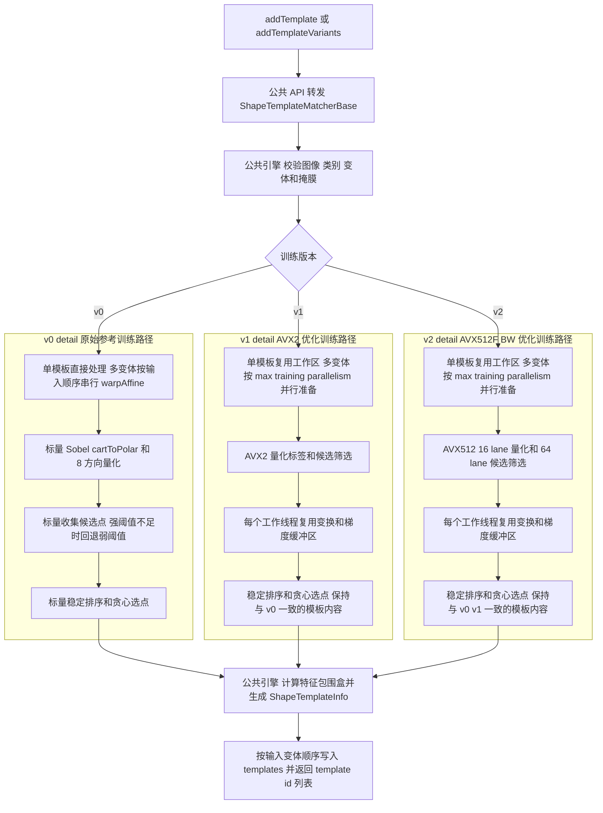
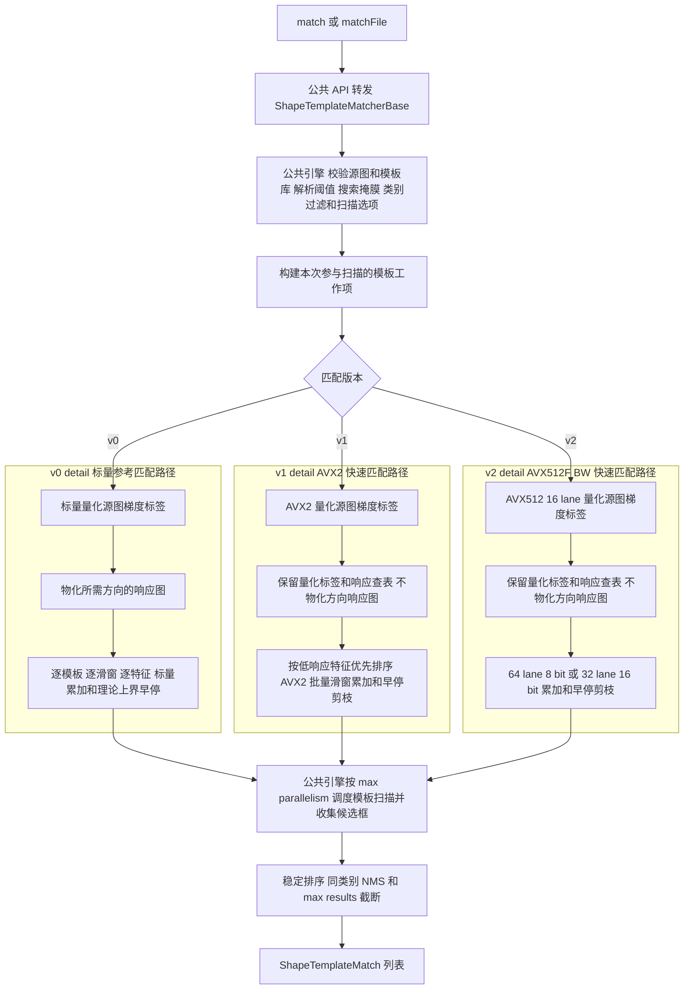

# ShapeTemplateMatcher 形状模板匹配完整流程

本文档说明 `src/features` 中形状模板匹配模块的端到端流程。公共入口是
`IShapeTemplateMatcher` 和版本工厂；具体实现为
`irt::features::v0::ShapeTemplateMatcher`（原始参考实现）与
`irt::features::v1::ShapeTemplateMatcherFast`（AVX2 快速实现）以及
`irt::features::v2::ShapeTemplateMatcherAvx512`（AVX512F/BW 快速实现）。它参考 `shape_based_matching`/LINEMOD 的思路：
训练阶段把目标轮廓表示为稀疏的梯度方向特征点，匹配阶段在源图中滑窗统计这些特征点平移后的方向一致性，
最后通过阈值、类别过滤、同类别 NMS 和最大数量限制返回匹配框。

该模块不依赖深度模型和 Faiss，适合边缘清晰、纹理不稳定、形状结构稳定的零件、标记、工件定位场景。

## 1. 主要文件

- `include/inferrt/features/ShapeTemplateMatcherTypes.hpp`：配置、模板信息、匹配结果和版本枚举。
- `include/inferrt/features/IShapeTemplateMatcher.hpp`：版本无关的公共接口。
- `include/inferrt/features/ShapeTemplateMatcher.hpp`：版本工厂和公共工具函数。
- `include/inferrt/features/ShapeTemplateMatcherBase.hpp`：v0/v1/v2 共用的 API 转发基类，保证外层流程一致。
- `include/inferrt/features/v0/ShapeTemplateMatcher.hpp`：v0 原始版本的具体 API。
- `include/inferrt/features/v1/ShapeTemplateMatcherFast.hpp`：v1 快速版本的具体 API。
- `include/inferrt/features/v2/ShapeTemplateMatcherAvx512.hpp`：v2 AVX512 快速版本的具体 API。
- `include/inferrt/features/ShapeTemplateMatcher.h`：C 风格头文件转发，便于统一 include 入口。
- `ShapeTemplateMatcherFactory.cpp`：版本工厂，以及角度/尺度变体与中心仿射变换工具的公共转发。
- `ShapeTemplateMatcher.cpp` / `ShapeTemplateMatcherFast.cpp` / `ShapeTemplateMatcherAvx512.cpp`：v0、v1、v2 公开入口；只构造各自私有实现，不复制公共 API 逻辑。
- `ShapeTemplateMatcherBase.cpp`：公共 API 的唯一转发实现。
- `priv/ShapeTemplateMatcherEngine.hpp/.cpp`：版本无关流程核心，负责图像校验、训练选点、持久化、匹配调度和 NMS。
- `priv/ShapeTemplateMatcherImpl.hpp/.cpp` / `priv/ShapeTemplateMatcherFastImpl.hpp/.cpp` / `priv/ShapeTemplateMatcherAvx512Impl.hpp/.cpp`：v0、v1、v2 的私有具体实现和各自热点内核。
- `samples/features/shape_template_matching/SampleShapeTemplateMatching.cpp`：训练、保存、加载、匹配和结果可视化示例。
- `tests/features/TestShapeTemplateMatcher.cpp`：配置校验、训练失败、平移匹配、非 SIMD 对齐尺寸、类别过滤、NMS、旋转变体、保存加载和文件 API 测试。

## 2. 配置入口

调用方通过 `ShapeTemplateMatcherConfig` 控制训练和匹配行为：

- `num_features`：每个模板最多保留的特征点数量，默认 `128`。数值越大，模板更细，但滑窗匹配成本更高。
- `min_features`：训练成功所需的最少有效特征点数，默认 `4`。低于该数量会认为模板没有足够形状信息。
- `weak_threshold`：源图梯度方向量化时使用的幅值阈值，默认 `30.0f`。
- `strong_threshold`：训练模板候选点的强梯度阈值，默认 `60.0f`。
- `max_label_difference`：方向 bin 容差，合法范围为 `[0, 4]`。`0` 表示方向必须完全一致，`1` 允许相邻 45 度方向有部分贡献。
- `match_threshold`：默认匹配分数阈值，范围为 `[0, 100]`，默认 `80.0f`。
- `nms_threshold`：同类别 NMS 的 IoU 阈值，默认 `0.3f`；小于 `0` 时关闭 NMS。
- `max_results`：最多返回的匹配数量；`0` 表示不限制。
- `scan_step`：滑窗扫描步长，单位为像素，默认 `1`。增大后速度更快，但位置精度降低。
- `min_feature_distance`：训练时贪心选点的最小间距；`0` 表示按模板面积和 `num_features` 自动估计。

常用初始化：

```cpp
irt::features::ShapeTemplateMatcherConfig config;
config.num_features         = 96;
config.min_features         = 8;
config.weak_threshold       = 10.0f;
config.strong_threshold     = 20.0f;
config.max_label_difference = 1;
config.match_threshold      = 85.0f;
config.nms_threshold        = 0.3f;
config.max_results          = 20;

irt::features::v1::ShapeTemplateMatcherFast matcher(config);
```

## 3. 输入数据要求

训练图和源图都支持灰度、BGR 或 BGRA 图像，内部会统一转为 `CV_8U` 灰度图。训练和匹配都可以传入掩膜：

- `object_mask`：模板训练掩膜，非零区域参与训练，零值区域忽略。
- `search_mask`：源图搜索掩膜，非零区域参与搜索，零值区域忽略。

掩膜要求：

- 掩膜尺寸必须与对应图像一致。
- 掩膜会被规范化为单通道 `CV_8U`。
- 模板掩膜建议只覆盖目标本体，避免背景边缘被训练进模板。
- 搜索掩膜当前以滑窗中心点为过滤依据：滑窗中心落在零值区域时跳过该位置。

类别由调用方通过 `class_id` 提供。一个类别可以包含多个模板，例如同一个零件的不同旋转角度和尺度。`template_id`
是当前类别内从 `0` 开始递增的模板 ID。

## 4. 单模板训练流程

单模板训练入口：

```cpp
const int template_id = matcher.addTemplate(template_image, "part", object_mask);
```

文件入口：

```cpp
const int template_id = matcher.addTemplateFile("part.png", "part", "part_mask.png");
```

### 4.1 v0 / v1 / v2 训练流程图



内部流程如下：

1. 校验训练图不能为空，`class_id` 不能为空，模板变体元数据中的角度必须有限，尺度必须大于 `0`。
2. 将训练图转成灰度图，并把 `object_mask` 规范化为同尺寸 `CV_8U` 掩膜。
3. 使用 OpenCV `Sobel` 计算 `grad_x` 和 `grad_y`。
4. 使用 `cartToPolar` 计算梯度幅值和角度。
5. 对每个有效像素做 8 方向量化：
   - 一圈 360 度被切成 8 个方向 bin。
   - 标签范围为 `[0, 7]`。
   - 掩膜为零或幅值低于 `weak_threshold` 的像素写为无效标签。
6. 在训练掩膜内收集候选点：
   - 候选点必须有有效方向标签。
   - 候选点幅值优先使用 `strong_threshold`。
   - 如果强阈值候选不足，并且 `weak_threshold < strong_threshold`，会回退到 `weak_threshold` 再收集一次。
7. 按梯度幅值从高到低稳定排序候选点，幅值相同时按坐标保证结果确定。
8. 根据 `min_feature_distance` 或自动估计距离，贪心选择空间上分散的候选点。
9. 如果初始距离导致特征不足，会逐步降低距离，直到满足 `min_features` 或退化到 1 像素间距。
10. 如果最终特征点数量仍小于 `min_features`，训练失败并抛出 `ERROR_INVALID_ARGUMENT`。
11. 计算选中特征点的最小包围盒，把特征坐标转为相对模板左上角的坐标。
12. 生成 `ShapeTemplateInfo`，写入 `class_id` 对应的模板列表，并返回类别内 `template_id`。

训练后的模板只保存稀疏特征点，不保存原始模板图。单个模板的核心数据包括：

- `width` / `height`：特征点包围盒尺寸。
- `tl_x` / `tl_y`：特征点包围盒在训练图中的左上角。
- `angle_degrees` / `scale`：模板变体元数据。
- `features`：相对模板包围盒的 `(x, y, label, angle_degrees)` 列表；v2 文件中每个特征编码为固定四列的 `[x, y, label, angle_degrees]` 数组。

## 5. 旋转和尺度模板训练流程

目标存在角度或尺度变化时，推荐用模板变体显式训练多份模板：

```cpp
const auto variants = irt::features::makeShapeTemplateAngleScaleVariants(
    0.0f, 180.0f, 15.0f, 0.9f, 1.1f, 0.1f);

const auto ids = matcher.addTemplateVariants(template_image, "part", object_mask, variants);
```

`makeAngleScaleVariants()` 使用闭区间生成参数，展开顺序是先尺度、再角度。上例会生成：

```text
scale = 0.9: angle = 0, 15, ..., 180
scale = 1.0: angle = 0, 15, ..., 180
scale = 1.1: angle = 0, 15, ..., 180
```

`addTemplateVariants()` 的内部流程：

1. 校验原始训练图和变体列表。
2. 规范化 `object_mask`。
3. 对每个 `ShapeTemplateVariant`：
   - 使用图像中心构造 `cv::getRotationMatrix2D(center, angle, scale)`。
   - 对训练图执行 `cv::warpAffine(..., INTER_LINEAR, BORDER_CONSTANT)`。
   - 对掩膜执行 `cv::warpAffine(..., INTER_NEAREST, BORDER_CONSTANT)`。
   - 调用单模板训练流程 `addTemplate()`。
4. 返回所有成功添加的模板 ID，顺序与输入 `variants` 一致。

注意：当前实现是在固定尺寸画布内做中心旋转/缩放。大角度或大尺度可能让目标被裁剪，训练前应给模板图留足边界。

## 6. 模板保存和加载流程

训练完成后可以把模板库保存为 OpenCV YAML/XML 文件：

```cpp
matcher.save("shape_templates.yaml");
```

下次直接加载：

```cpp
irt::features::v1::ShapeTemplateMatcherFast matcher;
matcher.load("shape_templates.yaml");
```

保存内容包括：

- `version`：模板文件版本；当前为破坏性的 `2`，不接受旧 `1`。
- `config`：训练/匹配配置，包括阈值、方向容差、NMS、扫描步长等。
- `templates`：所有类别下的模板信息和特征点列表。每个模板的 `features` 是二维数组，每行严格为 `[x, y, label, angle_degrees]`，不再为每个特征重复写字段名。

加载流程会先读入临时配置和临时模板库，完成配置校验、模板尺寸校验、特征数量校验、方向标签校验和变体元数据校验后，
再替换当前对象状态。这样可以避免加载失败时留下半初始化模板库。

模板文件格式 v2 是破坏性升级：已有 `version: 1` 模板文件不能加载，必须以当前版本重新训练。v0、v1 与 v2 实现都共享该模板格式，因而新生成的模板仍可在三个实现之间交叉加载。

## 7. 匹配流程

内存入口：

```cpp
irt::features::ShapeTemplateMatchOptions options; // 默认：template_stride=1，scan_step=0
const auto matches = matcher.match(source_image, 85.0f, {"part"}, search_mask, options);
```

文件入口：

```cpp
irt::features::ShapeTemplateMatchOptions options;
const auto matches = matcher.matchFile("scene.png", 85.0f, {"part"}, "search_mask.png", options);
```

### 7.1 v0 / v1 / v2 匹配流程图



匹配流程如下：

1. 校验源图不能为空，模板库不能为空。
2. 解析有效阈值：
   - `threshold >= 0` 时使用调用参数。
   - `threshold < 0` 时使用 `config.match_threshold`。
3. 规范化 `search_mask`。
4. 对源图执行与训练阶段一致的灰度转换、`Sobel`、`cartToPolar` 和 8 方向量化。
5. 根据 `max_label_difference` 构建源图方向响应数据：
   - v0 为实际参与匹配的模板方向标签物化响应图；响应值表示源图该像素方向对该模板方向的整数贡献，方向完全不匹配时贡献为 `0`。
   - v1/v2 保留量化方向标签和同一份响应查表，匹配时直接 SIMD 查表，不物化方向响应图。
6. 根据 `class_ids` 与运行时 `ShapeTemplateMatchOptions::template_stride` 决定参与匹配的模板：
   - `class_ids` 为空时扫描全部类别。
   - `class_ids` 非空时只扫描存在于模板库中的指定类别。
   - `template_stride=1` 时扫描全部变体；大于 1 时只扫描 `template_id % template_stride == 0` 的变体，这是显式近似模式。
7. 对每个模板做滑窗扫描：
   - 步长为 `options.scan_step > 0 ? options.scan_step : config.scan_step`。
   - 滑窗中心点在 `search_mask` 中为零时跳过。
8. 对每个滑窗位置累计模板特征点的方向贡献：v0 访问对应响应图并标量累加；v1 直接对量化标签进行 AVX2 查表与批量累加；v2 使用 AVX512 64-lane 8-bit 或 32-lane 16-bit 累加，非连续扫描时精确回退到标量路径。
9. 将累加贡献归一化为 `[0, 100]` 分数：

```text
similarity = 100 * sum(response(feature_i)) / (denominator_per_feature * feature_count)
```

10. 分数大于等于有效阈值时生成 `ShapeTemplateMatch`。
11. 对所有候选结果按分数从高到低排序，分数相同则按类别、模板 ID 和坐标稳定排序。
12. 如果 `nms_threshold >= 0`，执行同类别 NMS；不同类别之间不会互相压制。
13. 如果 `max_results > 0`，截断到最多 `max_results` 个结果。

返回的 `ShapeTemplateMatch` 包含：

- `x` / `y`：源图坐标系下的匹配框左上角。
- `width` / `height`：命中模板的包围盒尺寸。
- `similarity`：方向一致性分数，范围 `[0, 100]`。
- `class_id` / `template_id`：命中的类别和模板。
- `angle_degrees` / `scale`：命中模板的训练变体元数据。

## 8. 版本与指令集抽象

公共层将“如何管理模板和调度匹配”与“如何执行指令集热点”分开：

```text
IShapeTemplateMatcher / createShapeTemplateMatcher(version)
                         │
  v0::ShapeTemplateMatcher   v1::ShapeTemplateMatcherFast   v2::ShapeTemplateMatcherAvx512
                         │
             ShapeTemplateMatcherBase（公共 API 转发）
                    │              │              │
 v0::detail::ShapeTemplateMatcherImpl  v1::detail::ShapeTemplateMatcherFastImpl  v2::detail::ShapeTemplateMatcherAvx512Impl
                    └──────────────┬─┴──────────────┘
                     ShapeTemplateMatcherEngine（公共流程核心）
                                      │
                    ShapeTemplateMatcherKernel（公共策略协议）
                    │                │                 │
v0::detail::ShapeTemplateMatcherKernelImpl  v1::detail::ShapeTemplateMatcherFastKernelImpl  v2::detail::ShapeTemplateMatcherAvx512KernelImpl
```

- `ShapeTemplateMatcherBase` 是唯一的公共 API 转发层，所有接口方法在此处固定为最终实现；v0/v1/v2 不再复制一组相同的委托函数。
- `ShapeTemplateMatcherEngine` 是版本无关核心，只负责输入校验、模板管理、变体训练、序列化、响应数据调度、并行、NMS 和结果排序。
- `ShapeTemplateMatcherKernel` 定义可替换热点：是否物化响应图、方向标签量化、训练候选点收集、单方向响应图构建及单模板滑窗评分。
- `v0::detail::ShapeTemplateMatcherImpl` 只注入同一命名空间内的参考热点内核；`v1::detail::ShapeTemplateMatcherFastImpl` 只注入同一命名空间内的 AVX2 快速热点内核；`v2::detail::ShapeTemplateMatcherAvx512Impl` 只注入同一命名空间内的 AVX512F/BW 热点内核，并在创建时检查 CPU 指令集。
- 命名空间严格隔离：v0、v1、v2 的公开类、私有 `Impl`、热点内核和辅助函数均位于各自的 `v0::detail` / `v1::detail` / `v2::detail`，不互相包含或调用。`irt::features::detail` 只承载版本无关的公共转发基类、流程核心和内核协议；版本实现仅通过局部 `common` 别名访问这些协议。
- 三条路径产生相同的 `ShapeTemplateInfo`、`ShapeTemplateMatch` 和 YAML/XML 模板格式，因此可交叉加载与对照测试。

v1 的 AVX2 内核覆盖四段热点：每次处理 8 个 `float` 的方向量化、每次处理 32 个像素的候选点过滤、方向标签字节 shuffle 查表，以及批量滑窗打分。评分时按当前源图的方向响应均值重排特征；每累计 4 个特征即以理论上界淘汰不可能达标的整组候选。常见的分子上界不超过 255 时，v1 用 8-bit 累加一次处理 32 个相邻候选；较大但仍安全的配置使用 16-bit/16-lane 路径。`scan_step=2` 时，内核从连续 32-byte 读取中 shuffle 压缩出 16 个间隔候选，其他正步长使用 AVX2 gather。

v2 使用独立的 AVX512F/BW 内核：训练时每次量化 16 个 `float`、候选筛选 64 个像素；全图 `scan_step=1` 的精确匹配在上界不超过 255 时一次处理 64 个相邻候选，较大但仍安全的配置使用 32 个 16-bit lane。v2 与 v1 一样直接读取量化标签并查表，不物化方向响应图；`scan_step != 1` 或累计范围超过 16-bit 安全范围时会精确回退到标量路径。构造时同时检查 AVX512F 和 AVX512BW，以避免在不支持的 CPU 上执行非法指令。

CMake 只为 v1 内核源文件开启 AVX2、只为 v2 内核源文件开启 AVX512F/BW，不会把 CPU 指令集要求扩散到 v0、公共流程、示例或其他模块。OpenCV 的 `Sobel`、`cartToPolar`、`warpAffine` 仍会按其构建配置使用优化。

## 9. 示例程序

构建目标：

```text
inferrt_sample_shape_template_matching
```

示例通过 `--mode train` 和 `--mode match` 分开训练、匹配两个阶段。训练阶段只需要模板图和可选的模板掩膜，不需要传入源图：

```powershell
.\build\bin\inferrt_sample_shape_template_matching.exe `
  --mode train `
  --version v1 `
  --template D:\data\part.png `
  --template-mask D:\data\part_mask.png `
  --class-id part `
  --angle-begin 0 `
  --angle-end 180 `
  --angle-step 15 `
  --scale-begin 0.9 `
  --scale-end 1.1 `
  --scale-step 0.1 `
  --features 96 `
  --max-results 20 `
  --warmup 3 `
  --repeat 10 `
  --save-templates D:\data\shape_templates.yaml
```

`--template` 也可传入大图；提供 `--template-roi x,y,width,height` 后，示例会先裁剪该区域再训练。训练掩膜可与原始大图同尺寸（自动按 ROI 裁剪），也可直接与裁剪后的模板小图同尺寸。

匹配阶段加载训练文件，在源图中搜索：

```powershell
.\build\bin\inferrt_sample_shape_template_matching.exe `
  --mode match `
  --version v1 `
  --source D:\data\scene.png `
  --load-templates D:\data\shape_templates.yaml `
  --class-filter part `
  --threshold 85 `
  --warmup 3 `
  --repeat 10 `
  --output D:\data\shape_template_matching_result.png
```

匹配区域可通过与源图同尺寸的 `--search-mask` 限制；该参数与训练阶段的 `--template-mask` 用途不同。若上游已知目标区域，建议由上游先裁剪源图，再将裁剪图传入匹配器。

默认匹配保持精确：`--template-stride 1 --scan-step 0`。需要以召回、最佳变体或像素级定位精度换取延迟时，可显式设置更大的 `--template-stride` 或 `--scan-step`；它们不会写回模板文件。

`--version` 支持 `v0`、`v1` 和 `v2`，默认 `v1`。模板文件不绑定实现版本，因此可用 v0 训练、v1 或 v2 匹配，或将三个版本作为结果与性能对照。v2 需要运行 CPU 同时支持 AVX512F 与 AVX512BW。

示例默认预热 `3` 次并采样 `10` 次。`--warmup` 指定不计入统计的预热次数，`--repeat` 指定计时重复次数；输出会给出总耗时、均值、中位数、最小/最大值和标准差。训练计时只覆盖 `addTemplateVariants()`，匹配计时只覆盖 `match()`，不包括图像/YAML 读写、ROI 裁剪、绘制与结果写入。

## 10. 参数调优建议

- 目标边缘弱或图像对比度低：降低 `weak_threshold` 和 `strong_threshold`，同时适当提高 `min_features` 避免误训练噪声。
- 背景边缘很复杂：提供精确 `object_mask`，并提高 `strong_threshold` 或减小 `num_features`。
- 旋转变化明显：用 `addTemplateVariants()` 训练角度模板；角度步长越小，召回越好，但模板数量和匹配时间线性增加。
- 尺度变化明显：训练多个 `scale`；尺度步长越小，召回越好，但模板数量线性增加。
- 定位结果有 1 到数个像素偏差：保持 `scan_step = 1`；如果只需要粗定位，可以在本次匹配设置更大的 `ShapeTemplateMatchOptions::scan_step`（示例为 `--scan-step`）。
- 误检较多：提高 `match_threshold`，减小 `max_label_difference`，或提高 `nms_threshold` 后再观察候选框分布。
- 同一目标返回多个重叠框：保持 `nms_threshold >= 0`，常用范围为 `0.2` 到 `0.5`。
- 匹配太慢：若上游已知目标区域，应由上游先裁剪图像并单独评估整个流水线；若必须全图匹配且可接受近似，再提高 `template_stride`、增大 `scan_step`、减少模板变体数量或减少 `num_features`。
- 只关心某些类别：调用 `match()` 时传入 `class_ids`，避免扫描无关类别模板。

## 11. 注意事项和限制

- 模块匹配的是形状边缘方向，不直接比较颜色、纹理或深度特征。
- 纯色、低对比度、无明显边缘的目标可能无法训练出足够特征点。
- 高重复纹理、规则网格、强背景边缘容易产生误检，建议配合掩膜和搜索 ROI 使用。
- 模板保存的是稀疏梯度方向特征，不保存原始图像；加载后可以直接匹配。
- 当前匹配是在每个已训练模板尺寸上做 2D 滑窗，不会在匹配阶段连续搜索任意角度或任意尺度；角度和尺度需要在训练阶段离散化。
- `angle_degrees` 和 `scale` 是模板元数据，用于解释结果，不会在匹配阶段重新变换源图。
- 大角度/大尺度训练时要确保模板图四周留有空白，避免 `warpAffine` 裁掉目标边缘。
- `search_mask` 过滤的是滑窗中心点，不是检查整个匹配框是否完全落在掩膜内。
- `max_label_difference` 越大，方向容忍越强，但不同形状之间的区分度会下降。
- `num_features` 越大，模板越细，匹配耗时也越高；对刚性零件通常先从 `64` 到 `128` 试起。
